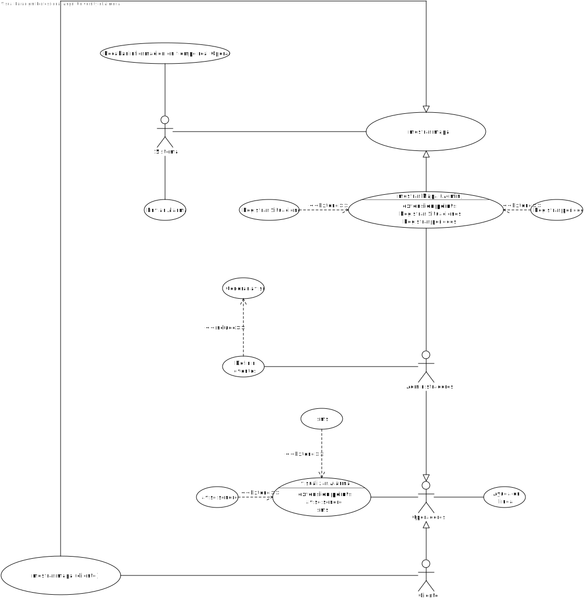

# 🔵 ERS - Equipo - Azul - 2022 🔵

## Portal Web de Transporte de Gran Canaria

### Version 1.0

🔷 FRANCISCO DE BORJA JOSE GUTIERREZ CARRASCO

🔷 FRANCISCO JAVIER MOTA LOPEZ

🔷 JUAN RAUL MELLADO GARCIA

🔷 ANGEL NIETO BURGOS

# Hoja de revisión

| Fecha      | Versión | Descripción                                                                | Autor                                        |
| :--------- | :------- | :-------------------------------------------------------------------------- | :------------------------------------------- |
| 08/11/2022 | 1.0      | Preparar preguntas para el entrevistador                                    | Francisco de Borja José Gutiérrez Carrasco |
| 11/11/2022 | 1.0      | Resaltado del pliego de condiciones, y revision de respuestas               | Francisco de Borja José Gutiérrez Carrasco |
| 15/11/2022 | 1.0      | Organigrama, glosario de datos, y especificación de los diagramas          | Francisco Javier Mota López                 |
| 18/11/2022 | 1.0      | Objetivos del negocio                                                       | Francisco de Borja José Gutiérrez Carrasco |
| 22/11/2022 | 1.0      | Toma de requisitos                                                          | Francisco Javier Mota López                 |
| 26/11/2022 | 1.0      | Aclaracion en casos de uso                                                  | Juan Raul Mellado Garcia                     |
| 29/11/2022 | 1.1      | Revision de casos de uso                                                    | Juan Raul Mellado Garcia                     |
| 2/12/2022  | 1.0      | Diagramas casos de uso + Diagrama ER                                        | Ángel Nieto Burgos                          |
| 13/12/2022 | 1.0      | Defensa con Manel + Arreglo del ERS en el repo + Revision de lo que tenemos |                                              |

# Introducción

En este documento se va a tratar la recopilación de toda la información necesaria para el uso y modificación del programa cuya implementación ha sido encargada por  la Autoridad Única del Transporte de Gran Canaria. Este proyecto se dividen en dos subproyectos, los cuales son:

* Portal web con el objetivo de disponer de un portal de servicios al usuario del transporte regular de viajeros, de carácter interactivo, de conformidad con las prescripciones técnicas definidas en el pliego de condiciones y en el de condiciones administrativas particulares.
* Sistema de monitorización de la explotación de transporte, es decir,  un sistema de información y monitorización que aglutina las informaciones procedentes de los sistemas de información embarcados en los vehículos de los operadores, que permita disponer de una visión global, instantánea e histórica del estado de la explotación del transporte regular de viajeros en la isla desarrollado por los distintos operadores.

# Información del Dominio del problema

#### Organigrama

#### Glosario de terminos

|                    Término                    | Descripción                                                                                                                                                                   |
| :--------------------------------------------: | ------------------------------------------------------------------------------------------------------------------------------------------------------------------------------ |
|                     Guagua                     | Referido a autobús                                                                                                                                                            |
|                    Interfaz                    | Es la conexión funcional entre dos sistemas, programas, dispositivos o componentes que comunican de distintos niveles, permitiendo el intercambio de información             |
|                   CNPA-2002                   | Clasificación Nacional de Productos por Actividades 2002                                                                                                                      |
|                Libro de estilo                | Documento que ayuda a la comprensión de las partes de un proyecto                                                                                                             |
|                      CPV                      | Vocabulario Común de Contratos Públicos                                                                                                                                      |
|               Canales digitales               | Es un canal que sirve para dar servicio, comunicar o vender a través de un ordenador, una tablet o un móvil                                                                  |
|             Arquitectura software             | Pautas y criterios que se siguen en la elaboración abstracta a nivel de código dentro de un proyecto informático                                                            |
|                     AUTGC                     | Autoridad Única del Transporte de Gran Canaria                                                                                                                                |
|                   Licitante                   | Participar en una subasta pública ofreciendo la ejecución de un servicio a cambio de la obtención de dinero u otros beneficios.                                             |
|             Modificaciones comunes             | Modificación en conjunto de un elemento de múltiples páginas de forma simultánea                                                                                           |
|                 Editor WYSIWYG                 | Editor para el desarrollo de páginas web con previsualizador                                                                                                                  |
| Relación de cloud tag en la home del website. | Representación gráfica abstracta formada por múltiples palabras relacionadas con las funcionalidades de la página y con enlaces a ellas                                    |
|           Maquetación de contenido           | Utilización de una serie de recursos como las negritas, los sumarios y los títulos para favorecer la experiencia de usuario y facilitar la lectura de contenidos en internet |
|         Estructura de la base de datos         | Forma matemática mediante la cual se trabaja con los datos y las relaciones entre los mismos, de la manera más eficiente posible                                             |
|              Itinerario de línea              | Define, direcciona y describe el camino que va a ser recorrido o ruta.                                                                                                         |
|                     Tarifa                     | Cobro de servicios, durante un período determinado, por una cantidad fija y con independencia del tiempo y el tipo de su utilización.                                        |
|                   Transbordo                   | Trasladar efectos o personas de una embarcación a otra.                                                                                                                       |
|                  Tiempo Real                  | Un sistema que es capaz de responder y procesar la información al ritmo en que esta entra o se introduce                                                                      |
|       Consulta de programa informático       | Método que permite acceder a los datos guardados y realizar diversas acciones y operaciones                                                                                   |
|                Forma dinámica                | Método para reducir el tiempo de ejecución de un algoritmo mediante operaciones y estructuras óptimas                                                                       |
|                      SMET                      | Sistema de información y Monitorización de la Explotación del Transporte                                                                                                    |
|                      SIIT                      | Sistema Interactivo  Información Transport                                                                                                                                    |
|   HelpDesk para la atención de incidencias   | Hace referencia al conjunto de recursos humanos y tecnológicos que se dedican a la gestión de incidencias relacionadas con el soporte o la asistencia a usuarios.            |

# Necesidades del negocio

#### Objetivos del negocio

|    OBJ-1    |                                                                                                                                     SIIT                                                                                                                                     |
| :----------: | :--------------------------------------------------------------------------------------------------------------------------------------------------------------------------------------------------------------------------------------------------------------------------: |
|   Versión   |                                                                                                                                     1.0                                                                                                                                     |
| Descripción | Montar un sistema interactivo de información por el que los usuarios podrán conocer y disponer de las prestaciones que ofrece el servicio integrado de transporte público de viajeros de Gran Canaria relacionándolas con otras materias de ocio, turismo, cultura, etc. |
| Comentarios |                                                                                                    La información deberá ser accesible desde el portal web de la AUTGC.                                                                                                    |

|    OBJ-2    |                                                                                                                                               SMET                                                                                                                                               |
| :----------: | :-----------------------------------------------------------------------------------------------------------------------------------------------------------------------------------------------------------------------------------------------------------------------------------------------: |
|   Versión   |                                                                                                                                                1.0                                                                                                                                                |
| Descripción | Montar un sistema de información y monitorización de la explotación del transporte para la AUTGC que facilite reconocer, registrar y monitorizar en todo momento el grado de cumplimiento de las obligaciones de servicio de los operadores en base a una serie de condiciones parametrizables |
| Comentarios |                                                                                                                                              Ninguno                                                                                                                                              |

|    OBJ-3    |                                                                                                                                              Portal Web                                                                                                                                              |
| :----------: | :---------------------------------------------------------------------------------------------------------------------------------------------------------------------------------------------------------------------------------------------------------------------------------------------------: |
|   Versión   |                                                                                                                                                  1.0                                                                                                                                                  |
| Descripción | Se pide montar un portal web que abarque los aspectos de: identificar necesidades (contenidos, servicios, audiencias, etc), definir la estructura (arquitectura de la información, mapa web, etc) y organización del portal, detallar componentes organizativos, funcionales y técnicos del mismo. |
| Comentarios |                                                                            Forma parte del sistema SIIT, que se divide en dos partes: una el sistema de información y otra el portal web y ambos están interrelacionados                                                                            |

# Requisitos del sistema a desarrollar

#### Requisitos

| Requisito | Descripción | Tipo |
| :-------: | :----------: | :--: |
|ACT-01|||
|ACT-02|||
|ACT-03|||
|ACT-04|||
|ACT-05|||
|ACT-06|||
|ACT-07|||
|ACT-08|||
|ACT-09|||

#### Actores

| Código | Actor | Descripcion |
| :-------: | :----------: | :--: |
|ACT-01|Sistema||
|ACT-02|Cliente||
|ACT-03|Operadores||
|ACT-04|Administradores||
|ACT-05|Administrador(SIT)||
|ACT-06|Cliente(SIT)||
|ACT-07|Operador de transporte(SIT)||
|ACT-08|Auxiliar edicion||
|ACT-09|Sistema informacion||
|ACT-10|Cliente||
|ACT-11|Administrador||

#### Caso de uso

| Código |                      Casos de uso                      | Descripción |
| :-----: | :----------------------------------------------------: | :----------: |
|  UC-01  |                     Enviar alarma                     |              |
|  UC-02  |    Recabar informacion en tiempo real de operadores    |              |
|  UC-03  |                      Mostrar mapa                      |              |
|  UC-04  |                    Gestion de pagos                    |              |
|  UC-05  |                  mostrar Mapa (admin)                  |              |
|  UC-06  |                   Registrar periodos                   |              |
|  UC-07  |                 Registrar situaciones                 |              |
|  UC-08  |                     Definir evento                     |              |
|  UC-09  |                     Generar aviso                     |              |
|  UC-10  |                          sms                          |              |
|  UC-11  |                   Visualizar alarma                   |              |
|  UC-12  |                      Aviso sonoro                      |              |
|  UC-13  |                     Ayuda en linea                     |              |
|  UC-14  |                     Realizar pagos                     |              |
|  UC-15  |                 mostrar Mapa (cliente)                 |              |
|  UC-16  |                    Previsualizacion                    |              |
|  UC-17  |                    Edicion sencilla                    |              |
|  UC-18  |                    Añadir pagina                    |              |
|  UC-19  |                Mostrar paradas general                |              |
|  UC-20  |                  Mostrar mapa general                  |              |
|  UC-21  |                   Definir transbordo                   |              |
|  UC-22  |            Calcular distancia entre paradas            |              |
|  UC-23  |    Calculo de itinerarios recomendados tiempo real    |              |
|  UC-24  |              Mostrar parada inicio y fin              |              |
|  UC-25  |             Calcular tiempos de recorrido             |              |
|  UC-26  |                  Ayuda en linea(SIT)                  |              |
|  UC-27  |                      Localizacion                      |              |
|  UC-28  |                        Consulta                        |              |
|  UC-29  |                        Gestion                        |              |
|  UC-30  |                Herramienta de analisis                |              |
|  UC-31  |                  Definir inicio y fin                  |              |
|  UC-32  |                Ubicar zonas de interes                |              |
|  UC-33  | Consultar de forma dinamica la informacion de servicio |              |
|  UC-34  |               Mostrar itinerario de mapa               |              |
|  UC-35  |                     Definir zonas                     |              |
|  UC-36  |              Introduccion manual de datos              |              |
|  UC-37  |          Control y edicion de la informacion          |              |
|  UC-38  |                 Modificacion de datos                 |              |
|  UC-39  |                    Datos asociados                    |              |
|  UC-40  |                    Mostrar paradas                    |              |
|  UC-41  |                     Lista de datos                     |              |
|  UC-42  |           Identificar zonas no transitables           |              |
|  UC-43  |            Recoger informacion no recogida            |              |
|  UC-44  |                        Centrar                        |              |
|  UC-45  |                Mostar informacion linea                |              |
|  UC-46  |            Presentar recorrido cierta linea            |              |
|  UC-47  |                         Acecar                         |              |
|  UC-48  |                     Ir a mapa base                     |              |
|  UC-49  |                      Mostrar mapa                      |              |
|  UC-50  |                       Desplazar                       |              |
|  UC-51  |                         Alejar                         |              |
|  UC-52  |                     Editor WYSYWYG                     |              |
|  UC-53  |                       Modificar                       |              |
|  UC-54  |                        Buscador                        |              |
|  UC-55  |                  Mostrar estadisticas                  |              |
|  UC-56  |                        Retirar                        |              |
|  UC-57  |                        Publicar                        |              |
|  UC-58  |                       Acceso Web                       |              |
|  UC-59  |              Creacion de pagina sencilla              |              |
|  UC-60  |                  Modificacion general                  |              |
|  UC-61  |                    Previsualizacion                    |              |
|  UC-62  |            Entorno de colaboracion cliente            |              |
|  UC-63  |                          Blog                          |              |
|  UC-64  |                        CloudTag                        |              |
|  UC-65  |                Entorno de colaboracion                |              |
|  UC-66  |                          Foro                          |              |
|  UC-67  |                   Acceso Web Cliente                   |              |
|  UC-68  |                    Buscador cliente                    |              |

#### Especificacion de Diagramas

# Lista de diagrama de casos de uso del modelo

# Diagramas de casos de uso

## Diagrama SMET

# Lista general de casos de uso y actores del proyecto

Diagrama SMET

| Detalles de los actores |              |
| :---------------------: | :----------: |
|          Actor          | Descripción |
|         Sistema         |              |
|      Administrador      |              |
|        Operador        |              |
|         Cliente         |              |

|:--:|:--:|
|Nombre: |Descripción|
|Autor: ||
|Fecha: ||
|Descripcion: ||
|Actores: ||
|Precondiciones: ||
|Flujo normal: ||
|Flujo alternativo: ||
|Post condiciones: ||

# Detalle de los casos de uso

# Diagramas de clases asociados a los requisitos de información

## Requisitos de información del portal

| INF-001:           | Administrador                                                                          |
| :----------------- | :------------------------------------------------------------------------------------- |
| Versión:          | 1.0 (Diciembre-2022)                                                                   |
| Autor:             | Francisco Javier Mota López                                                           |
| Fuente:            | Pliego de condiciones                                                                  |
| Referencia:        | -                                                                                      |
| Descripción:      | Información sobre el usuario Administrador                                            |
| Datos especificos: | `<ul><li>`Nombre`</li><li>`Teléfono`</li><li>`Correo Electrónico`</li></ul>` |
| Importancia:       | Muy Importante                                                                         |
| Estado:            | Aceptado                                                                               |
| Comentar:          | -                                                                                      |

| INF-002:           | Cliente                                              |
| :----------------- | :--------------------------------------------------- |
| Versión:          | 1.0 (Diciembre-2022)                                 |
| Autor:             | Francisco Javier Mota López                         |
| Fuente:            | Pliego de condiciones                                |
| Referencia:        | -                                                    |
| Descripción:      |                                                      |
| Datos especificos: | `<ul><li>``</li><li>``</li><li>``</li></ul>` |
| Importancia:       | Muy Importante                                       |
| Estado:            | Aceptado                                             |
| Comentar:          | -                                                    |

| INF-003:           | Operador                                             |
| :----------------- | :--------------------------------------------------- |
| Versión:          | 1.0 (Diciembre-2022)                                 |
| Autor:             | Francisco Javier Mota López                         |
| Fuente:            | Pliego de condiciones                                |
| Referencia:        | -                                                    |
| Descripción:      |                                                      |
| Datos especificos: | `<ul><li>``</li><li>``</li><li>``</li></ul>` |
| Importancia:       | Muy Importante                                       |
| Estado:            | Aceptado                                             |
| Comentar:          | -                                                    |

| INF-004:           | Sistema                                              |
| :----------------- | :--------------------------------------------------- |
| Versión:          | 1.0 (Diciembre-2022)                                 |
| Autor:             | Francisco Javier Mota López                         |
| Fuente:            | Pliego de condiciones                                |
| Referencia:        | -                                                    |
| Descripción:      |                                                      |
| Datos especificos: | `<ul><li>``</li><li>``</li><li>``</li></ul>` |
| Importancia:       | Muy Importante                                       |
| Estado:            | Aceptado                                             |
| Comentar:          | -                                                    |

| INF-005:           | Servicio                                             |
| :----------------- | :--------------------------------------------------- |
| Versión:          | 1.0 (Diciembre-2022)                                 |
| Autor:             | Francisco Javier Mota López                         |
| Fuente:            | Pliego de condiciones                                |
| Referencia:        | -                                                    |
| Descripción:      |                                                      |
| Datos especificos: | `<ul><li>``</li><li>``</li><li>``</li></ul>` |
| Importancia:       | Muy Importante                                       |
| Estado:            | Aceptado                                             |
| Comentar:          | -                                                    |

| INF-006:           | Itinerario                                           |
| :----------------- | :--------------------------------------------------- |
| Versión:          | 1.0 (Diciembre-2022)                                 |
| Autor:             | Francisco Javier Mota López                         |
| Fuente:            | Pliego de condiciones                                |
| Referencia:        | -                                                    |
| Descripción:      |                                                      |
| Datos especificos: | `<ul><li>``</li><li>``</li><li>``</li></ul>` |
| Importancia:       | Muy Importante                                       |
| Estado:            | Aceptado                                             |
| Comentar:          | -                                                    |

| INF-007:           | Datos                                                |
| :----------------- | :--------------------------------------------------- |
| Versión:          | 1.0 (Diciembre-2022)                                 |
| Autor:             | Francisco Javier Mota López                         |
| Fuente:            | Pliego de condiciones                                |
| Referencia:        | -                                                    |
| Descripción:      |                                                      |
| Datos especificos: | `<ul><li>``</li><li>``</li><li>``</li></ul>` |
| Importancia:       | Muy Importante                                       |
| Estado:            | Aceptado                                             |
| Comentar:          | -                                                    |

| INF-008:           | Parada                                               |
| :----------------- | :--------------------------------------------------- |
| Versión:          | 1.0 (Diciembre-2022)                                 |
| Autor:             | Francisco Javier Mota López                         |
| Fuente:            | Pliego de condiciones                                |
| Referencia:        | -                                                    |
| Descripción:      |                                                      |
| Datos especificos: | `<ul><li>``</li><li>``</li><li>``</li></ul>` |
| Importancia:       | Muy Importante                                       |
| Estado:            | Aceptado                                             |
| Comentar:          | -                                                    |

| INF-009:           | Mapa                                                 |
| :----------------- | :--------------------------------------------------- |
| Versión:          | 1.0 (Diciembre-2022)                                 |
| Autor:             | Francisco Javier Mota López                         |
| Fuente:            | Pliego de condiciones                                |
| Referencia:        | -                                                    |
| Descripción:      |                                                      |
| Datos especificos: | `<ul><li>``</li><li>``</li><li>``</li></ul>` |
| Importancia:       | Muy Importante                                       |
| Estado:            | Aceptado                                             |
| Comentar:          | -                                                    |

| INF-010:           | Línea                                               |
| :----------------- | :--------------------------------------------------- |
| Versión:          | 1.0 (Diciembre-2022)                                 |
| Autor:             | Francisco Javier Mota López                         |
| Fuente:            | Pliego de condiciones                                |
| Referencia:        | -                                                    |
| Descripción:      |                                                      |
| Datos especificos: | `<ul><li>``</li><li>``</li><li>``</li></ul>` |
| Importancia:       | Muy Importante                                       |
| Estado:            | Aceptado                                             |
| Comentar:          | -                                                    |

| INF-010:           | Alarma                                               |
| :----------------- | :--------------------------------------------------- |
| Versión:          | 1.0 (Diciembre-2022)                                 |
| Autor:             | Francisco Javier Mota López                         |
| Fuente:            | Pliego de condiciones                                |
| Referencia:        | -                                                    |
| Descripción:      |                                                      |
| Datos especificos: | `<ul><li>``</li><li>``</li><li>``</li></ul>` |
| Importancia:       | Muy Importante                                       |
| Estado:            | Aceptado                                             |
| Comentar:          | -                                                    |

## Requisitos de información del sistema interactivo de información del transporte (SIIT)

| INF-001:           | Administrador                                        |
| :----------------- | :--------------------------------------------------- |
| Versión:          | 1.0 (Diciembre-2022)                                 |
| Autor:             | Francisco Javier Mota López                         |
| Fuente:            | Pliego de condiciones                                |
| Referencia:        | -                                                    |
| Descripción:      |                                                      |
| Datos especificos: | `<ul><li>``</li><li>``</li><li>``</li></ul>` |
| Importancia:       | Muy Importante                                       |
| Estado:            | Aceptado                                             |
| Comentar:          | -                                                    |

| INF-009:           | Usuario logueado                                     |
| :----------------- | :--------------------------------------------------- |
| Versión:          | 1.0 (Diciembre-2022)                                 |
| Autor:             | Francisco Javier Mota López                         |
| Fuente:            | Pliego de condiciones                                |
| Referencia:        | -                                                    |
| Descripción:      |                                                      |
| Datos especificos: | `<ul><li>``</li><li>``</li><li>``</li></ul>` |
| Importancia:       | Muy Importante                                       |
| Estado:            | Aceptado                                             |
| Comentar:          | -                                                    |

| INF-009:           | Usuario invitado                                     |
| :----------------- | :--------------------------------------------------- |
| Versión:          | 1.0 (Diciembre-2022)                                 |
| Autor:             | Francisco Javier Mota López                         |
| Fuente:            | Pliego de condiciones                                |
| Referencia:        | -                                                    |
| Descripción:      |                                                      |
| Datos especificos: | `<ul><li>``</li><li>``</li><li>``</li></ul>` |
| Importancia:       | Muy Importante                                       |
| Estado:            | Aceptado                                             |
| Comentar:          | -                                                    |

# Apéndices

## Detalles de entrevista

| Ficha entrevista |                                                |
| :--------------: | ---------------------------------------------- |
|   Entrevistado   | Juan Palomo (Conductor de autobuses)           |
|      Fecha      | 15 de noviembre de 2022                        |
|       Hora       | 9:10                                           |
|      Lugar      | Laboratorio de análisis y diseño de software |
|      Asunto      | Sistema de Transporte Público Canario         |

## Desarrollo de la entrevista

| Ficha entrevista |                                                                                                                                                                                                  |                                                                                                                                                                                                                                                                                                                                                                                                                |
| :--------------: | :----------------------------------------------------------------------------------------------------------------------------------------------------------------------------------------------: | :-------------------------------------------------------------------------------------------------------------------------------------------------------------------------------------------------------------------------------------------------------------------------------------------------------------------------------------------------------------------------------------------------------------: |
|      Tiempo      |                                                                                            Preguntas                                                                                            |                                                                                                                                                                                                   Respuestas                                                                                                                                                                                                   |
|      1 min      |                                                        ¿Qué transportes se agrupan en la denominación de transporte público canario?                                                        |                                                                                                                                 Autobuses, barcos entre distintas islas, taxis públicos, carros turísticos tirados de caballos (forman parte del transporte publico canario)                                                                                                                                 |
|      1 min      |                                               ¿Qué tipos de datos se debería tener en cuenta por cada usuario interesado en usar el transporte?                                               |                                                                                                                                                                           Ninguno adicional al que viene en el pliego de condiciones.                                                                                                                                                                           |
|      2 min      |                                                         ¿Qué métodos de pago se pueden contemplar dentro de los servicios ofrecidos?                                                         |                                  Pago en efectivo, pago con tarjeta de transporte del gobierno de las islas canarias (cada persona empadronada en la isla puede sacarse esa tarjeta y sale con un descuento, recargable). Se recarga yendo al kiosco con tarjeta o efectivo y en los autobuses con dinero en efectivo. Uso exclusivo de la tarjeta para personas empadronadas.                                  |
|      1 min      |                                                        ¿Como enlazamos los aspectos de ocio, cultura y turismo dentro de la aplicación?                                                        |                                                                                                                                              En el portal por medio de noticias mientras que en las paradas y rutas se indicarán en el apartado de observaciones                                                                                                                                              |
|      30 seg      | ¿El sistema de información y monitorización de la explotación de transporte debe de ser trasparente y público, o por el contrario, exclusivo de la Autoridad Única del Transporte canario? |                                                                                                                                                                                            En principio es público.                                                                                                                                                                                            |
|      20 seg      |                                                              ¿El buscador tendría que funcionar con eventos, líneas y destginos?                                                              |                                                                                                                                                                                                       Sí                                                                                                                                                                                                       |
|      1 min      |                                                    ¿Tiene alguna preferencia de diseño, como por ejemplo en cuanto a la paleta de colores?                                                    |                                                                                                                                         La mayoría de las páginas del ayuntamiento de las islas canarias se hace con colores muy claros (azul muy claro por ejemplo).                                                                                                                                         |
|      2 min      |                                                             ¿Los itinerarios recomendados incluyen tanto ubicaciones como eventos?                                                             | La idea es que cuando alguien busque una ruta (Punto A a punto B) pueda tener la ruta más corta posible/ rápida, una ruta turística. Tener filtros. En principio no se informa sobre el turismo de las islas Canarias. Horario de autobuses subido en la página web con las paradas. Nosotros tendríamos que ajustar y definir bien las paradas, fotos a las paradas, mapa, por donde va el autobús, etc. |
|      1 min      |                                                            ¿Los usuarios que busquen información, deben tener la sesión iniciada?                                                            |                                                                                                                                                      No, accesible a todo el mundo porque es un engorro iniciar sesión para consultar como va un autobús                                                                                                                                                      |
|      1 min      |                           ¿La ubicación a tiempo real del transporte se hará en la aplicación, o por el contrario el propio transporte tendría un sistema propio?                           |                                                                                                                   Normalmente, las aplicaciones del móvil hacen que la batería dure poco, es preferente un dispositivo dentro del autobús o un móvil con una aplicación solo para ello.                                                                                                                   |
|      1 min      |                                                             ¿A qué se refiere con observaciones dentro del resultado de consultas?                                                             |                                                                                                                                  Cuando tú hagas el pedido de paradas o rutas, en observaciones pondrán cosas como lugares turísticos más cercanos, caminos cortados, etc.                                                                                                                                  |
