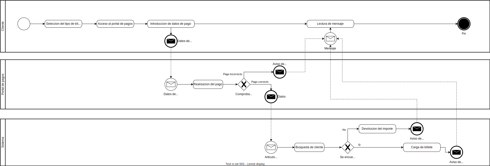

# 🔵 ERS - Equipo - Azul - 2022 🔵 

## Portal Web de Transporte de Gran Canaria

### Version 1.0

# Hoja de revisión

| Fecha      | Versión | Descripción                                                                | Autor                                        |
| :--------- | :------- | :-------------------------------------------------------------------------- | :------------------------------------------- |
| 08/11/2022 | 1.0      | Preparar preguntas para el entrevistador                                    | :large_blue_diamond: Equipo Azul :large_blue_diamond: |
| 11/11/2022 | 1.0      | Resaltado del pliego de condiciones, y revision de respuestas               | :large_blue_diamond: Equipo Azul :large_blue_diamond: |
| 15/11/2022 | 1.0      | Organigrama, glosario de datos, y especificación de los diagramas          | :large_blue_diamond: Equipo Azul :large_blue_diamond:                 |
| 18/11/2022 | 1.0      | Objetivos del negocio                                                       | :large_blue_diamond: Equipo Azul :large_blue_diamond: |
| 22/11/2022 | 1.0      | Toma de requisitos                                                          | :large_blue_diamond: Equipo Azul :large_blue_diamond:                 |
| 26/11/2022 | 1.0      | Aclaracion en casos de uso                                                  | :large_blue_diamond: Equipo Azul :large_blue_diamond:                     |
| 29/11/2022 | 1.1      | Revision de casos de uso                                                    | :large_blue_diamond: Equipo Azul :large_blue_diamond:                    |
| 2/12/2022  | 1.0      | Diagramas casos de uso + Diagrama ER                                        | :large_blue_diamond: Equipo Azul :large_blue_diamond:                          |
| 13/12/2022 | 1.0      | Defensa con Manel + Arreglo del ERS en el repo + Revision de lo que tenemos | :large_blue_diamond: Equipo Azul :large_blue_diamond:                |

# Introducción

En este documento se va a tratar la recopilación de toda la información necesaria para el uso y modificación del programa cuya implementación ha sido encargada por  la Autoridad Única del Transporte de Gran Canaria. Este proyecto se dividen en dos subproyectos, los cuales son:

* Portal web con el objetivo de disponer de un portal de servicios al usuario del transporte regular de viajeros, de carácter interactivo, de conformidad con las prescripciones técnicas definidas en el pliego de condiciones y en el de condiciones administrativas particulares.
* Sistema de monitorización de la explotación de transporte, es decir,  un sistema de información y monitorización que aglutina las informaciones procedentes de los sistemas de información embarcados en los vehículos de los operadores, que permita disponer de una visión global, instantánea e histórica del estado de la explotación del transporte regular de viajeros en la isla desarrollado por los distintos operadores.

# Información del Dominio del problema

#### Organigrama

#### Glosario de terminos

|                    Término                    | Descripción                                                                                                                                                                   |
| :--------------------------------------------: | ------------------------------------------------------------------------------------------------------------------------------------------------------------------------------ |
|                     Guagua                     | Referido a autobús                                                                                                                                                            |
|                    Interfaz                    | Es la conexión funcional entre dos sistemas, programas, dispositivos o componentes que comunican de distintos niveles, permitiendo el intercambio de información             |
|                   CNPA-2002                   | Clasificación Nacional de Productos por Actividades 2002                                                                                                                      |
|                Libro de estilo                | Documento que ayuda a la comprensión de las partes de un proyecto                                                                                                             |
|                      CPV                      | Vocabulario Común de Contratos Públicos                                                                                                                                      |
|               Canales digitales               | Es un canal que sirve para dar servicio, comunicar o vender a través de un ordenador, una tablet o un móvil                                                                  |
|             Arquitectura software             | Pautas y criterios que se siguen en la elaboración abstracta a nivel de código dentro de un proyecto informático                                                            |
|                     AUTGC                     | Autoridad Única del Transporte de Gran Canaria                                                                                                                                |
|                   Licitante                   | Participar en una subasta pública ofreciendo la ejecución de un servicio a cambio de la obtención de dinero u otros beneficios.                                             |
|             Modificaciones comunes             | Modificación en conjunto de un elemento de múltiples páginas de forma simultánea                                                                                           |
|                 Editor WYSIWYG                 | Editor para el desarrollo de páginas web con previsualizador                                                                                                                  |
| Relación de cloud tag en la home del website. | Representación gráfica abstracta formada por múltiples palabras relacionadas con las funcionalidades de la página y con enlaces a ellas                                    |
|           Maquetación de contenido           | Utilización de una serie de recursos como las negritas, los sumarios y los títulos para favorecer la experiencia de usuario y facilitar la lectura de contenidos en internet |
|         Estructura de la base de datos         | Forma matemática mediante la cual se trabaja con los datos y las relaciones entre los mismos, de la manera más eficiente posible                                             |
|              Itinerario de línea              | Define, direcciona y describe el camino que va a ser recorrido o ruta.                                                                                                         |
|                     Tarifa                     | Cobro de servicios, durante un período determinado, por una cantidad fija y con independencia del tiempo y el tipo de su utilización.                                        |
|                   Transbordo                   | Trasladar efectos o personas de una embarcación a otra.                                                                                                                       |
|                  Tiempo Real                  | Un sistema que es capaz de responder y procesar la información al ritmo en que esta entra o se introduce                                                                      |
|       Consulta de programa informático       | Método que permite acceder a los datos guardados y realizar diversas acciones y operaciones                                                                                   |
|                Forma dinámica                | Método para reducir el tiempo de ejecución de un algoritmo mediante operaciones y estructuras óptimas                                                                       |
|                      SMET                      | Sistema de información y Monitorización de la Explotación del Transporte                                                                                                    |
|                      SIIT                      | Sistema Interactivo  Información Transport                                                                                                                                    |
|   HelpDesk para la atención de incidencias   | Hace referencia al conjunto de recursos humanos y tecnológicos que se dedican a la gestión de incidencias relacionadas con el soporte o la asistencia a usuarios.            |

# Necesidades del negocio

#### Objetivos del negocio

|    OBJ-1    |                                                                                                                                     SIIT                                                                                                                                     |
| :----------: | :--------------------------------------------------------------------------------------------------------------------------------------------------------------------------------------------------------------------------------------------------------------------------: |
|   Versión   |                                                                                                                                     1.0                                                                                                                                     |
| Descripción | Montar un sistema interactivo de información por el que los usuarios podrán conocer y disponer de las prestaciones que ofrece el servicio integrado de transporte público de viajeros de Gran Canaria relacionándolas con otras materias de ocio, turismo, cultura, etc. |
| Comentarios |                                                                                                    La información deberá ser accesible desde el portal web de la AUTGC.                                                                                                    |

|    OBJ-2    |                                                                                                                                               SMET                                                                                                                                               |
| :----------: | :-----------------------------------------------------------------------------------------------------------------------------------------------------------------------------------------------------------------------------------------------------------------------------------------------: |
|   Versión   |                                                                                                                                                1.0                                                                                                                                                |
| Descripción | Montar un sistema de información y monitorización de la explotación del transporte para la AUTGC que facilite reconocer, registrar y monitorizar en todo momento el grado de cumplimiento de las obligaciones de servicio de los operadores en base a una serie de condiciones parametrizables |
| Comentarios |                                                                                                                                              Ninguno                                                                                                                                              |

|    OBJ-3    |                                                                                                                                              Portal Web                                                                                                                                              |
| :----------: | :---------------------------------------------------------------------------------------------------------------------------------------------------------------------------------------------------------------------------------------------------------------------------------------------------: |
|   Versión   |                                                                                                                                                  1.0                                                                                                                                                  |
| Descripción | Se pide montar un portal web que abarque los aspectos de: identificar necesidades (contenidos, servicios, audiencias, etc), definir la estructura (arquitectura de la información, mapa web, etc) y organización del portal, detallar componentes organizativos, funcionales y técnicos del mismo. |
| Comentarios |                                                                            Forma parte del sistema SIIT, que se divide en dos partes: una el sistema de información y otra el portal web y ambos están interrelacionados                                                                            |

## Modelos de negocio

### Subprocesos y tareas
#### Pago y gestion de billetes online

El cliente selecciona el tipo de billete, accede al  portal de pagos e introduce los datos de pago. Los datos de pago y del articulo se envian al gestor de pagos para procesar dicho pago, si el pago es incorrecto, se envia un mensaje al cliente y se finaliza el proceso, sin embargo, si el pago es correcto, los datos del cliente y el articulo se envian al sistema para que este busque y añada el articulo que ha pagado, en caso de que el sistema no encuentre al cliente, se le devulve el importe. En cualquier caso, se le envia un mensaje indicandole lo sucedido y el proceso finaliza.

#### Diagrama

#### Envio Notificaciones

El sistema comprueba cada 5 minutos que se cumplen las condiciones de las alarmas  ,cuando se cumplen se envia una alarma a la aplicación del operador de transporte, en el caso de que la app este abierta sera visual en el caso de que este cerrada se comprobara cual es la especificacion del operador ya sea que prefiera que  le envie la notificacion por sms o prefiera recibir una notificacion sonora.

#### Diagrama

# Requisitos del sistema a desarrollar

#### Requisitos

|Requisito|Descripción|Tipo|
|:--:|:--:|:--:|
|Edicion sencilla|Interfaz que facilite la introduccion de datos a los menos versados en html|Funcional|
|Mostrar paradas|Interfaz de usuario que muestra las paradas y sus datos asociados|Funcional|
|Definir itinerario|Se ha de poder definir el itinerario de inicio a fin con la posibilidad de mostrarlo en el mapa|Funcional|
|Ayuda en linea|Todo usuario ha de poder solicitar ayuda cuando sea necesario|Funcional|
|Mostrar Mapa|Se requiere un mapa cartografico interactivo|Funcional|
|Control y  edición de la informacion |Interfaz que nos permite ver una listados de datos ,introducir datos manualmente y modificar datos segun convenga |Funcional|
|Identificar zonas no transitables|El sistema de informacion ha de ser capaza de identificar zonas no transitables y alterar los itinerarios segun sea necesario|Funcional|
|calculo de itinerarios recomendados tiempo real|El sistema de informacion ha de ser capaz de calcular el mejor itinerario en tiempo real y una vez esta calculado lo muestra |Funcional|
|Calcular tiempos de recorrido|El sistema de informacion ha de ser capaz de calcular el tiempo de recorrido|Funcional|
|Calcular distancias entre paradas|El sistema de informacion ha de ser capaz de calcular distancias entre paradas|Funcional|
|Definir transbordo|El sistema de informacion ha de ser capaz de definir si es necesario un transbordo |Funcional|
|Ubicar zonas de interes|Los administradores han de ser capaces de ubicar zonas de interes |Funcional|
|Definir zonas|Los administradores han de ser capaces de crear zonas|Funcional|
|Presentar recorrido cierta linea|El sistema de informacion ha de poder mostrar el recorrido de una linea y si se quiere la informacion de la correspondiente linea|Funcional|
|Herramientas de analisis|herramientas de analisis, consulta, localizacion y gestion, con el objeto de que el usuario del transporte publico pueda consultar de forma dinamica la informacion del servicio permitiendole conocer y programar con antelacion su viaje. |Funcional|
||||
|Realizar Pagos|El cliente ha de ser capaz de pagar con tarjeta y  que el sistema de monitorizacion sea capaz de gestionarlo|Funcional|
|Recabar informacion en tiempo real Operadores|El sistema de monitorizacion se va a encargar de recabar informacion de los operadores de transporte |Funcional|
|Gestion de Alarmas|El sistema de monitorizacion debe poder enviar Alarmas y los todos los usuarios han de poder visualizar las Alarmas on en el caso de que la app este cerrada recibir un sms o una norificacion sonora|Funcional|
|Visualizar Mapa (Admin)|Los administradores han de poder visualizar en un mapa dado por el sistema de monitorizacion los datos de los conductores y de la explotacion donde tendran la opcion de registrar incidencias o periodos de tiempo|Funcional|
|Definir eventos|Se han de poder registrar eventos por parte de los administradores|Funcional|
||||
|Editor WYSYWYG|El portal  tiene que tener un editor de este tipo|Funcional|
|Mostrar estadisticas|El portal es capaz de mostrar la estadisticas de acceso a los administradores|Funcional|
|Gestor de contenidos|El administrador ha de ser capaza de modificar ,retirar y publicar contenido segun su juicio|Funcional|
|Creacion de pagina sencilla|En el portal se ha de poder modificar de forma sencilla una pagina o un conjunto de paginas siempre mostrando una previsualizacion antes de  aceptar la modificacion |Funcional|
|Etorno de colaboracion | El portal ha de poseer un entorno de colaboracion accesible por los administradores y los clientes formado por un blog, un foro y el cloid tag que siempre esta en la pagina principal|Funcional|
|Acceso Web|El portal ha de ser accesible por la web para administradores y clientes|Funcional|

# Casos de uso

## Diagrama SMET

## Diagrama SIIT

## Diagrama Portal

#### Actores diagrama SMET

| Código | Actor | Descripcion |
| :-------: | :----------: | :--: |
|ACT-01|Sistema de monitorizacion| Actor referente al sistema de gestion de pagos |
|ACT-02|Cliente| Actor referente a los clientes del sistema|
|ACT-03|Operadores de transporte| Actor referente a los usuarios que manejan el transporte publico|
|ACT-04|Administradores| Actor referente a usuarios con privilegos en el sistema|

#### Actores diagrama SIT

| Código | Actor | Descripcion |
| :-------: | :----------: | :--: |
|ACT-05|Administrador(SIT)|Actor referente a usuario con privilegos en el sistema SIT|
|ACT-06|Cliente(SIT)|Actor referente a los clientes del sistema SIT|
|ACT-07|Operador de transporte(SIT)| Actor referente a los usuarios que manejan el transporte publico del sistema SIT|
|ACT-08|Sistema informacion|Actor referente al sistema de informacion incluido en el sistema SIT|

#### Actores diagrama PORTAL

| Código | Actor | Descripcion |
| :-------: | :----------: | :--: |
|ACT-09|Usuario anonimo|Actor referente a los usuarios que acceden al portal sin registro|
|ACT-10|Cliente|Actor referente a los clientes del portal|
|ACT-11|Administrador|Actor referente a usuario con privilegos en el portal|

#### Caso de uso

| Código |                      Casos de uso                      | Descripción |
| :-----: | :----------------------------------------------------: | :----------: |
|  UC-01  |                     Enviar alarma                     |     Caso de uso referente a la creación y envio de alarmas del sistema         |
|  UC-02  |    Recabar informacion en tiempo real Operadores    |     Caso de uso referente a la funcionalidad del sistema para conocer los datos en tiempo real de los operadores de transporte         |
|  UC-03  |                      Mostrar mapa                      |    Caso de uso referente a la funcionalidad del sistema de mostrar el mapa          |
|  UC-04  |                    Gestion de pagos                    |    Caso de uso referente a la gestion que realiza el sistema al recibir un pago          |
|  UC-05  |                  Visualizar Mapa (Admin)                  |  Caso de uso referente a la funcionalidad del administrador de ver el mapa            |
|  UC-06  |                   Registrar periodos                   |    Caso de uso referente a la funcionalidad de registrar un periodo concreto          |
|  UC-07  |                 Registrar situaciones                 |   Flujo alternativo de UC-05. Registra situaciones inusuales/puntuales comunicadas al administrador           |
|  UC-08  |                     Definir evento                     |      Añade un evento al sistema        |
|  UC-09  |                     Generar aviso                     |         Funcion que genera una alarma especifica de un evento     |
|  UC-10  |                          SMS                          |  Si la apliacion se encuentra cerrada, se envia un sms al cliente            |
|  UC-11  |                   Visualizar alarma                   |    Visualiza una alarma recibida          |
|  UC-12  |                      Aviso sonoro                      |   Si la apliacion se encuentra cerrada, se envia un aviso sonoro al cliente           |
|  UC-13  |                     Ayuda en linea (SMET)(SMET)                     |     Funcion de ayuda en linea de uso general         |
|  UC-14  |                     Realizar pagos                     |      Se realiza el pago de un billete        |
|  UC-15  |                 Mostrar itinerarios en mapa                 |  Una opcion de visualizacion del itinerario ya definido por el cliente            |
|  UC-16  |                    Definir itinerario                    |    Funcion por la que el cliente introduce los datos de itinerario para que el sistema calcule el itinerario mas recomendable          |
|  UC-17  |                   Ver paradas                    |   Funcion por la que se pueden ver las paradas y lineas ya organizadas por el sistema           |
|  UC-18  |                    Mostrar mapa general                    |   Funcion por la que los usuario pueden interactuar con el mapa interactivo renderizado por el sistema           |
|  UC-19  |                Definir transbordo                |      Funcion por la cual el sistema, mediante los datos de las lineas, calcula los transbordos incluyendo entre vehiculos diferentes        |
|  UC-20  |                  Calcular distancia entre paradas                  |      El sistema calcula la distancia entre las paradas        |
|  UC-21  |                  Calculo de itinerarios recomendados tiempo real                 |   El sistema calcula los tiempos de recorrido segun los datos           |
|  UC-22  |            Ayuda en linea (SMET)             |   Funcion de ayuda en linea de uso general           |
|  UC-23  |    Localizacion    |          Funcion por la que el administrador localiza operadores de transporte en el sistema    |
|  UC-24  |              Consulta               |    Funcion por la que el administrador consulta datos del servicio          |
|  UC-25  |             Gestion             |   Funcion por la que se gestiona la informacion del servicio           |
|  UC-26  |                  Herramienta de analisis                |      Funcion que permite al administrador gestionar la informacion del servicio de forma dinamica        |
|  UC-27  |                     Definir inicio y fin                    |   Funcion para introducir el inicio y fin de un itinerario           |
|  UC-28  |                        Ubicar zonas de interes                        |   Parte del flujo alternativo de CU-37. Funcion para introducir zonas marcadas como zonas de interes para el calculo de itinerarios           |
|  UC-29  |                        Consultar de forma dinamica                        |   Funcion por la que el cliente puede consultar la informacion del servicio de forma dinamica           |
|  UC-30  |                Definir zonas             |      El sistema usa los datos cartograficos para delimitar zonas, municipios y barrios        |
|  UC-31  |                  Introduccion manual de datos                  |   Parte del flujo alternativo de CU-37. Metodo para la introduccion de datos necesarios para el calculo de itinerarios en el sistema           |
|  UC-32  |                Control y edicion de la informacion               |     Desarrollo de los procesos de control, edicion de la informacion, carga inicial y mantenimiento de datos         |
|  UC-33  | Modificacion de datos |      Parte del flujo alternativo de CU-37. Funcion para modificar los datos necesarios para el calculo de itinerarios        |
|  UC-34  |              Datos asociados                |     Funcion por la que el sistema comprueba los datos de paradas y lineas introducidos por el administrador         |
|  UC-35  |                   Organizar paradas y lineas                  |   Funcion por la cual el sistema organiza las paradas y lineas segun los datos que le ha dado el administrador           |
|  UC-36  |              Listados de datos            |   Parte del flujo alternativo de CU-37. Proceso para visualizar listados de horarios y servicios necesarios para el calculo de itinerarios           |
|  UC-37  |         Centrar         |    Funcion que centra el mapa          |
|  UC-38  |               Mostrar informacion linea               |   Funcion que muestra la informacion de una linea           |
|  UC-39  |               Acercar                |    Funcion que acerca el mapa          |
|  UC-40  |                   Ir a mapa base                   |   Funcion que desplaza el mapa           |
|  UC-41  |                  Mostrar mapa                  | Funcion encargada de mostrar el mapa interactivo de la aplicacion             |
|  UC-42  |           Desplazar        |   Funcion que desplaza el mapa           |
|  UC-43  |         Alejar           |     Funcion que aleja el mapa         |
|  UC-44  |                      Editor WYSYWYG                    | Editor para el desarrollo de paginas web con previsualizador que usan los administradores             |
|  UC-45  |              Modificar              |  Funcion por la cual el administrador puede modificar contenidos del portal            |
|  UC-46  |         Buscador           |  Funcion que permite buscar informacion tanto en el foro como en la pagina            |
|  UC-47  |                       Mostrar estadisticas                   | Funcion por la cual el administrador es capaz de visualizar las estadisticas del sitio             |
|  UC-48  |                     Retirar                  |     Funcion por la que el administrador puede retirar contenido del portal         |
|  UC-49  |                    Publicar                     |   Funcion por la que el administrador puede publicar contenidos en el portal           |
|  UC-50  |                    Acceso web                   | Acceso web a la informacion de interes tanto turistica como del transporte             |
|  UC-51  |                         Creacion de pagina sencilla                       |  Interfaz por la que los administradores mas novatos en html pueden editar la pagina de forma sencilla            |
|  UC-52  |                    Modificacion general                 |    Funcion que permite modificar contenido en varias paginas o todas en general          |
|  UC-53  |                       Previsualizacion                       | Previsualizacion de los cambios realizados durante la edicion de una pagina             |
|  UC-54  |                        Entorno de colaboracion cliente                        |  Entorno de colaboracion donde se pueden acceder a varias funcionalidades            |
|  UC-55  |                  Blog                  |Acceso al Blog              |
|  UC-56  |                        CloudTag                        |   Acceso al cloudtag           |
|  UC-57  |                      Entorno de colaboracion                        | Entorno de colaboracion donde se pueden acceder a varias funcionalidades y el administrador puede moderar             |
|  UC-58  |                      Foro                   |   Acceso al foro           |
|  UC-59  |             Acceso web cliente             |  Acceso web a la informacion de interes tanto turistica como del transporte            |
|  UC-60  |                 Buscador cliente                |    Funcion que permite buscar informacion tanto en el foro como en la pagina          |
|  UC-61  |                     Acceso web sin registro                    |   Acceso web a la informacion de interes tanto turistica como del transporte usuarios no registrados           |
|  UC-62  |          Gestor de contenido    |     Gestor por el cual el administrador puede controlar contenidos del portal         |

# Detalle de los casos de uso

| UC-01               |   |
| :----------------- | - |
| Nombre:            | Enviar alarma  |
| Autor:             | :large_blue_diamond: Equipo Azul :large_blue_diamond:  |
| Fecha:             | 14/12/2022  |
| Descripción:       | Caso de uso referente a la creación y envio de alarmas del sistema|
| Actores:           | Sistema de monitorizacion |
| Precondiciones:    |  - |
| Flujo Normal:      | 1. El sistema recibe un evento a avisar   2. El sistema crea una alarma   3. El sistema envia una alarma a los destinatarios  |
| Flujo Alternativo: |  - |
| Poscondiciones:    |  - |

| UC-02                |   |
| :----------------- | - |
| Nombre:            | Recabar informacion en tiempo real Operadores  |
| Autor:             | :large_blue_diamond: Equipo Azul :large_blue_diamond:  |
| Fecha:             | 14/12/2022  |
| Descripción:       | Caso de uso referente a la funcionalidad del sistema para conocer los datos en tiempo real de los operadores de transporte  |
| Actores:           | Sistema de monitorizacion |
| Precondiciones:    | Operador de transporte habilitado en el sistema  |
| Flujo Normal:      | 1. El operador de transporte activa el dispositivo de seguimiento   2. El dispositivo envia constantemente los datos del operador de transporte y su posición   3. El sistema recibe estos datos |
| Flujo Alternativo: | 3A. El sistema deja de recibir la informacion   3.1A. El sistema muestra el mensaje "operador de transporte deslocalizado"  |
| Poscondiciones:    | -  |

| UC-03                |   |
| :----------------- | - |
| Nombre:            | Mostrar mapa  |
| Autor:             | :large_blue_diamond: Equipo Azul :large_blue_diamond:  |
| Fecha:             | 14/12/2022  |
| Descripción:       | Caso de uso referente a la funcionalidad del sistema de mostrar el mapa  |
| Actores:           | Sistema de monitorizacion  |
| Precondiciones:    | Usuario administrador registrado en el sistema. Mapa creado en el sistema. Información sobre el mapa |
| Flujo Normal:      | 1. El sistema organiza la informacion del mapa   2. El sistema crea el mapa con la informacion de los operadores de transporte que se le ha añadido |
| Flujo Alternativo: | 2A. El sistema puede no localizar algo en el mapa por un error al introducir los datos   2.1A El sistema muestra que hay un error en la informacion introducida  |
| Poscondiciones:    |   |

| UC-04                |   |
| :----------------- | - |
| Nombre:            | Gestion de pagos  |
| Autor:             | :large_blue_diamond: Equipo Azul :large_blue_diamond:  |
| Fecha:             | 14/12/2022  |
| Descripción:       | Caso de uso referente a la gestion que realiza el sistema al recibir un pago  |
| Actores:           | Sistema de monitorizacion |
| Precondiciones:    | Un cliente realiza un pago  |
| Flujo Normal:      | 1. El sistema comprueba que el pago se ha realizado correctamente   2. El sistema busca en la base de datos al cliente   3. El sistema añade el articulo asociado al pago realizado  |
| Flujo Alternativo: | 1A. El pago no se ha realizado correctamente   1.1A. El sistema muestra el mensaje "El pago no se ha realizado correctamente"   2A. El sistema no encuentra al cliente   2.1A. El sistema muestra el mensaje "cliente no encontrado"   2.2A. El sistema realiza la devolucion del importe pagado |
| Poscondiciones:    | Articulo añadido en la base del cliente que ha realizado el pago  |

| UC-05                |   |
| :----------------- | - |
| Nombre:            | Visualizar Mapa (Admin)  |
| Autor:             | :large_blue_diamond: Equipo Azul :large_blue_diamond:  |
| Fecha:             | 14/12/2022  |
| Descripción:       | Caso de uso referente a la funcionalidad del administrador de ver el mapa con los datos de los operadores sobre el |
| Actores:           | Administrador  |
| Precondiciones:    | Usuario administrador registrado en el sistema. Mapa creado en el sistema. Información sobre el mapa  |
| Flujo Normal:      | 1. El sistema organiza la informacion del mapa   2. El sistema crea el mapa con la informacion de los operadores de transporte que se le ha añadido    3. El sistema muestra el mapa con la iformacion asociada |
| Flujo Alternativo: | 2A. El sistema puede no localizar algo en el mapa por un error al introducir los datos   2.1A El sistema muestra que hay un error en la informacion introducida   3A. El administrador recibe el aviso de una situacion inusual/puntual   3A.1. El administrador añade dicha situacion a la informacion del mapa   3A.2. El sistema modifica la informacion que se muestra en el mapa   3B. Un administrador accede al mapa   3.1B. El sistema registra toda la informacion de lo que va pasando   3.1B.1. El sistema no tiene espacio para realizar el registro de la informacion.   3.1B.2. El sistema muestra el mensaje "No hay espacio suficiente"    |
| Poscondiciones:    | El sistema guarda la informacion registrada, Se cambia la informacion del mapa|

| UC-06                |   |
| :----------------- | - |
| Nombre:            | Registrar periodos  |
| Autor:             | :large_blue_diamond: Equipo Azul :large_blue_diamond:  |
| Fecha:             | 14/12/2022  |
| Descripción:       | Caso de uso referente a la funcionalidad de registrar un periodo concreto  |
| Actores:           | Administrador  |
| Precondiciones:    | Usuario administrador registrado en el sistema  |
| Flujo Normal:      | 1. Un administrador accede al mapa   2. El sistema registra toda la informacion de lo que va pasando |
| Flujo Alternativo: | 3A. El sistema no tiene espacio para realizar el registro de la informacion.   3.1A. El sistema muestra el mensaje "No hay espacio suficiente"  |
| Poscondiciones:    | El sistema guarda todo lo transcurrido en el periodo de tiempo grabado  |

| UC-07                |   |
| :----------------- | - |
| Nombre:            | Registrar situaciones  |
| Autor:             | :large_blue_diamond: Equipo Azul :large_blue_diamond:  |
| Fecha:             | 14/12/2022  |
| Descripción:       | Flujo alternativo de UC-05. Registra situaciones inusuales/puntuales comunicadas al administrador   |
| Actores:           | Administrador  |
| Precondiciones:    | Sucesión de una situacion inusual/puntual y comunicada dicha situacion  |
| Flujo Normal:      | 1. El administrador recibe el aviso de una situacion inusual/puntual   2. El administrador añade dicha situacion a la informacion del mapa   3. El sistema modifica la informacion que se muestra en el mapa  |
| Flujo Alternativo: | - |
| Poscondiciones:    | Se cambia la informacion del mapa  |

| UC-08                |   |
| :----------------- | - |
| Nombre:            | Definir evento  |
| Autor:             | :large_blue_diamond: Equipo Azul :large_blue_diamond:  |
| Fecha:             | 14/12/2022  |
| Descripción:       | Añade un evento al sistema  |
| Actores:           | Administrador  |
| Precondiciones:    | Evento existente  |
| Flujo Normal:      | 1. El administrador accede al sistema   2. El administrador accede al aparatado de creacion de eventos   3. Se cumplen las condiciones del evento   4. Se genera la alarma del aviso   5. Se envia la alarma al sistema |
| Flujo Alternativo: | -  |
| Poscondiciones:    | Se añade el evento a la base de datos  |

| UC-09                |   |
| :----------------- | - |
| Nombre:            | Generar aviso  |
| Autor:             | :large_blue_diamond: Equipo Azul :large_blue_diamond:  |
| Fecha:             | 14/12/2022  |
| Descripción:       | Funcion que genera una alarma especifica de un evento  |
| Actores:           | Administrador  |
| Precondiciones:    | -  |
| Flujo Normal:      | 1. Se cumplen las condiciones del evento   2. Se genera la alarma del aviso   3. Se envia la alarma al sistema  |
| Flujo Alternativo: | -  |
| Poscondiciones:    | - |

| UC-10                |   |
| :----------------- | - |
| Nombre:            | SMS  |
| Autor:             | :large_blue_diamond: Equipo Azul :large_blue_diamond:  |
| Fecha:             | 14/12/2022  |
| Descripción:       | Si la apliacion se encuentra cerrada, se envia un sms al cliente  |
| Actores:           | Operador de transporte, Cliente, Administrador |
| Precondiciones:    | El cliente ha seleccionado sms como metodo de aviso. Apliacion cerrada  |
| Flujo Normal:      | 1. La aplicacion esta cerrada   2. Se envia un sms al cliente  |
| Flujo Alternativo: | -  |
| Poscondiciones:    | -  |

| UC-11                |   |
| :----------------- | - |
| Nombre:            | Visualizar alarma  |
| Autor:             | :large_blue_diamond: Equipo Azul :large_blue_diamond:  |
| Fecha:             | 14/12/2022  |
| Descripción:       | Visualiza una alarma recibida  |
| Actores:           | Operador de transporte, Cliente, Administrador  |
| Precondiciones:    | Alarma enviada por el sistema  |
| Flujo Normal:      | 1. Se comprueba que la aplicacion se encuetra abierta   2. Se muestra por pantalla una notificacion visual  |
| Flujo Alternativo: | 1A. La aplicacion esta cerrada   1A.1. Se envia un aviso sonoro al cliente   1B. La aplicacion esta cerrada   1B.1. Se envia un sms al cliente  |
| Poscondiciones:    |  - |

| UC-12                |   |
| :----------------- | - |
| Nombre:            | Aviso sonoro  |
| Autor:             | :large_blue_diamond: Equipo Azul :large_blue_diamond:  |
| Fecha:             | 14/12/2022  |
| Descripción:       | Si la apliacion se encuentra cerrada, se envia un aviso sonoro al cliente  |
| Actores:           | Operador de transporte, Cliente, Administrador |
| Precondiciones:    | El cliente ha seleccionado aviso sonoro como metodo de aviso. Apliacion cerrada  |
| Flujo Normal:      | 1. La aplicacion esta cerrada   2. Se envia un aviso sonoro al cliente  |
| Flujo Alternativo: | -  |
| Poscondiciones:    | -  |

| UC-13                |   |
| :----------------- | - |
| Nombre:            |Ayuda en linea (SMET)  |
| Autor:             | :large_blue_diamond: Equipo Azul :large_blue_diamond:  |
| Fecha:             | 14/12/2022  |
| Descripción:       | Funcion de ayuda en linea de uso general |
| Actores:           |Operadores de transporte , Clientes, Administradores  |
| Precondiciones:    | Informacion de ayuda añadida a la base de datos  |
| Flujo Normal:      | 1. El usuario consulta la informacion correspondiente a sus necesidades  |
| Flujo Alternativo: | 1A. El usuario no encuentra la informacion que necesita   1.1A. El usuario se pone en contacto con AUTGC para indicar su duda   1.1A.1 Se añade un apartado nuevo  |
| Poscondiciones:    | Se almacenan los nuevos apartados |

| UC-14                |   |
| :----------------- | - |
| Nombre:            | Realizar pagos  |
| Autor:             | :large_blue_diamond: Equipo Azul :large_blue_diamond:  |
| Fecha:             | 14/12/2022  |
| Descripción:       | Se realiza el pago de un billete  |
| Actores:           | Cliente  |
| Precondiciones:    | -  |
| Flujo Normal:      | 1. Se selecciona el tipo de billete a comprar   2. Se accede al portal de pagos   3. Se introducen los datos de pago   4. Se realiza el pago   5. Se verifica que el pago se ha realizado correctamente  |
| Flujo Alternativo: | 5A. No se realiza el pago correctamente   5A.1. Se muestra el mensaje "No se ha realizado el pago correctamente"  |
| Poscondiciones:    | Se asocia el billete al cliente  |

| UC-15                |   |
| :----------------- | - |
| Nombre:            | Mostrar itinerarios en mapa  |
| Autor:             | :large_blue_diamond: Equipo Azul :large_blue_diamond:  |
| Fecha:             | 14/12/2022  |
| Descripción:       | Una opcion de visualizacion del itinerario ya definido por el cliente  |
| Actores:           | Cliente  |
| Precondiciones:    | itinerario definido por el cliente  |
| Flujo Normal:      | 1. El itinerario se muestra en el mapa  |
| Flujo Alternativo: | -  |
| Poscondiciones:    | -  |

| UC-16               |   |
| :----------------- | - |
| Nombre:            | Definir itinerario  |
| Autor:             | :large_blue_diamond: Equipo Azul :large_blue_diamond:  |
| Fecha:             | 14/12/2022  |
| Descripción:       | Funcion por la que el cliente introduce los datos de itinerario para que el sistema calcule el itinerario mas recomendable |
| Actores:           | Cliente  |
| Precondiciones:    | Itinerarios calculados por el sistema  |
| Flujo Normal:      | 1. El cliente define inicio   2. El cliente define fin    3. El cliente selecciona calcular itinerario   4. Se muestra una representacion sencilla del itinerario |
| Flujo Alternativo: | 4A. El itinerario se muestra en el mapa|
| Poscondiciones:    | Se guardan los datos  |

| UC-17              |   |
| :----------------- | - |
| Nombre:            | Ver paradas |
| Autor:             | :large_blue_diamond: Equipo Azul :large_blue_diamond:  |
| Fecha:             | 14/12/2022  |
| Descripción:       | Funcion por la que se pueden ver las paradas y lineas ya organizadas por el sistema  |
| Actores:           | Cliente, Operador de transporte, Administrador  |
| Precondiciones:    | El sistema ha de tener organizadas las paradas y lineas  |
| Flujo Normal:      | 1. Se muestran las lineas y paradas |
| Flujo Alternativo: | 1A. Se selecciona una linea   1A.1. Se muestra la informacion de esa linea  |
| Poscondiciones:    | -  |

| UC-18                |   |
| :----------------- | - |
| Nombre:            | Mostrar mapa general  |
| Autor:             | :large_blue_diamond: Equipo Azul :large_blue_diamond:  |
| Fecha:             | 14/12/2022  |
| Descripción:       | Funcion por la que los usuario pueden interactuar con el mapa interactivo renderizado por el sistema  |
| Actores:           | Operador de transporte, Cliente, Administrador  |
| Precondiciones:    | -  |
| Flujo Normal:      | 1. El sistema crea el mapa en base a los datos cartograficos   2. El sistema renderiza el mapa|
| Flujo Alternativo: | 2A. Se centra el mapa   2B. Se acerca el mapa   2C. Se aleja el mapa    2D. Se desplaza el mapa en cualquier direccion   2E. Se vuelve a colocar como el mapa en su estado inicial |
| Poscondiciones:    | -  |

| UC-19                |   |
| :----------------- | - |
| Nombre:            | Definir transbordo  |
| Autor:             | :large_blue_diamond: Equipo Azul :large_blue_diamond:  |
| Fecha:             | 14/12/2022  |
| Descripción:       | Funcion por la cual el sistema, mediante los datos de las lineas, calcula los transbordos incluyendo entre vehiculos diferentes  |
| Actores:           | Sistema de informacion |
| Precondiciones:    | Datos de la linea presentados  |
| Flujo Normal:      | 1. El sistema obtiene los datos   2. El sistema organiza los transbordos|
| Flujo Alternativo: | -  |
| Poscondiciones:    | Los transbordos se guardan en la base de datos  |

| UC-20                |   |
| :----------------- | - |
| Nombre:            | Calcular distancia entre paradas  |
| Autor:             | :large_blue_diamond: Equipo Azul :large_blue_diamond:  |
| Fecha:             | 14/12/2022  |
| Descripción:       | El sistema calcula la distancia entre las paradas  |
| Actores:           | Sistema de informacion |
| Precondiciones:    | Datos de las paradas introducidos manualmente  |
| Flujo Normal:      | 1. El sistema obtiene los datos   2. Se calcula la distancia |
| Flujo Alternativo: | 2A. Se identifica que no se puede transitar de una parada a otra   2B. Se ofrece una parada cercana sustituta  |
| Poscondiciones:    | Se guardan las distancias en la base de datos  |

| UC-21                |   |
| :----------------- | - |
| Nombre:            | Calculo de itinerarios recomendados tiempo real  |
| Autor:             | :large_blue_diamond: Equipo Azul :large_blue_diamond:  |
| Fecha:             | 14/12/2022  |
| Descripción:       | El sistema calcula los tiempos de recorrido segun los datos  |
| Actores:           | Sistema de informacion |
| Precondiciones:    | Datos introducidos manualmente  |
| Flujo Normal:      | 1. El sistema define el recorrido   2. El sistema calcula el recorrido |
| Flujo Alternativo: | 2A. El sistema encuentra que el recorrido no es transitable   2A.1. Se ofrece un recorrido sustituto  |
| Poscondiciones:    | -  |

| UC-22               |   |
| :----------------- | - |
| Nombre:            |Ayuda en linea (SMET)  |
| Autor:             | :large_blue_diamond: Equipo Azul :large_blue_diamond:  |
| Fecha:             | 14/12/2022  |
| Descripción:       | Funcion de ayuda en linea de uso general |
| Actores:           | Operadores de transporte , Clientes, Administradores  |
| Precondiciones:    | Informacion de ayuda añadida a la base de datos  |
| Flujo Normal:      | 1. El usuario consulta la informacion correspondiente a sus necesidades  |
| Flujo Alternativo: | 1A. El usuario no encuentra la informacion que necesita   1.1A. El usuario se pone en contacto con AUTGC para indicar su duda   1.1A.1 Se añade un apartado nuevo  |
| Poscondiciones:    | Se almacenan los nuevos apartados |

| UC-23                |   |
| :----------------- | - |
| Nombre:            | Localizacion  |
| Autor:             | :large_blue_diamond: Equipo Azul :large_blue_diamond:  |
| Fecha:             | 14/12/2022  |
| Descripción:       |  Funcion por la que el administrador localiza operadores de transporte en el sistema |
| Actores:           | Administrador  |
| Precondiciones:    |  - |
| Flujo Normal:      | 1. El administrador localiza operadores de transporte |
| Flujo Alternativo: |  - |
| Poscondiciones:    |  - |

| UC-24                |   |
| :----------------- | - |
| Nombre:            | Consulta  |
| Autor:             | :large_blue_diamond: Equipo Azul :large_blue_diamond:  |
| Fecha:             | 14/12/2022  |
| Descripción:       | Funcion por la que el administrador consulta datos del servicio  |
| Actores:           | Administrador  |
| Precondiciones:    | -  |
| Flujo Normal:      | 1. El administrador consulta datos de servicio  |
| Flujo Alternativo: | -  |
| Poscondiciones:    | -  |

| UC-25                |   |
| :----------------- | - |
| Nombre:            | Gestion  |
| Autor:             | :large_blue_diamond: Equipo Azul :large_blue_diamond:  |
| Fecha:             | 14/12/2022  |
| Descripción:       | Funcion por la que se gestiona la informacion del servicio |
| Actores:           | Administrador  |
| Precondiciones:    |  - |
| Flujo Normal:      | 1. El administrador gestiona la informacion del servicio   |
| Flujo Alternativo: |  - |
| Poscondiciones:    |  - |

| UC-26                |   |
| :----------------- | - |
| Nombre:            | Herramienta de analisis  |
| Autor:             | :large_blue_diamond: Equipo Azul :large_blue_diamond:  |
| Fecha:             | 14/12/2022  |
| Descripción:       | Funcion que permite al administrador gestionar la informacion del servicio de forma dinamica  |
| Actores:           | Administrador  |
| Precondiciones:    | -  |
| Flujo Normal:      | 1. El administrador decide las herramientas a usar |
| Flujo Alternativo: | 2A. El administrador consulta datos del servicio   2B. El administrador localiza operadores de transporte   2C. El administrador gestiona la informacion del servicio  |
| Poscondiciones:    | -  |

| UC-27                |   |
| :----------------- | - |
| Nombre:            | Definir inicio y fin  |
| Autor:             | :large_blue_diamond: Equipo Azul :large_blue_diamond:  |
| Fecha:             | 14/12/2022  |
| Descripción:       | Funcion para introducir el inicio y fin de un itinerario  |
| Actores:           | Cliente  |
| Precondiciones:    | -  |
| Flujo Normal:      | 1. El cliente define inicio   2. El cliente define fin |
| Flujo Alternativo: | -  |
| Poscondiciones:    | Se guardan los datos  |

| UC-28                |   |
| :----------------- | - |
| Nombre:            | Ubicar zonas de interes  |
| Autor:             | :large_blue_diamond: Equipo Azul :large_blue_diamond:  |
| Fecha:             | 14/12/2022  |
| Descripción:       | Parte del flujo alternativo de CU-37. Funcion para introducir zonas marcadas como zonas de interes para el calculo de itinerarios |
| Actores:           | Administrador  |
| Precondiciones:    | -  |
| Flujo Normal:      | 1. El administrador introduce los datos de la zona de interes |
| Flujo Alternativo: | - |
| Poscondiciones:    | Los datos de la ubicacion de interes se introducen en la base de datos  |

| UC-29                |   |
| :----------------- | - |
| Nombre:            | Consultar de forma dinamica  |
| Autor:             | :large_blue_diamond: Equipo Azul :large_blue_diamond:  |
| Fecha:             | 14/12/2022  |
| Descripción:       | Funcion por la que el cliente puede consultar la informacion del servicio de forma dinamica  |
| Actores:           | Cliente  |
| Precondiciones:    | -  |
| Flujo Normal:      | 1. Constantemente consulta la informacion del servicio actualizando la informacion que muestra  |
| Flujo Alternativo: | -  |
| Poscondiciones:    | -  |

| UC-30                |   |
| :----------------- | - |
| Nombre:            | Definir zonas  |
| Autor:             | :large_blue_diamond: Equipo Azul :large_blue_diamond:  |
| Fecha:             | 14/12/2022  |
| Descripción:       | El sistema usa los datos cartograficos para delimitar zonas, municipios y barrios  |
| Actores:           | Sistema de informacion |
| Precondiciones:    | -  |
| Flujo Normal:      | 1. El sistema obtiene los datos cartograficos   2. El sistema delimita las zonas   3. El sistema delimita municipios   4. El sistema delimita barrios |
| Flujo Alternativo: | -  |
| Poscondiciones:    | Se añaden los datos de las zonas, municipios y barrios a la base de datos |

| UC-31                |   |
| :----------------- | - |
| Nombre:            | Introduccion manual de datos  |
| Autor:             | :large_blue_diamond: Equipo Azul :large_blue_diamond:  |
| Fecha:             | 14/12/2022  |
| Descripción:       | Parte del flujo alternativo de CU-37. Metodo para la introduccion de datos necesarios para el calculo de itinerarios en el sistema  |
| Actores:           | Administrador  |
| Precondiciones:    | -  |
| Flujo Normal:      | 1. El administrador introduce los datos    |
| Flujo Alternativo: | -  |
| Poscondiciones:    | Los datos introducidos se guardan en la base de datos  |

| UC-32                |   |
| :----------------- | - |
| Nombre:            | Control y edicion de la informacion  |
| Autor:             | :large_blue_diamond: Equipo Azul :large_blue_diamond:  |
| Fecha:             | 14/12/2022  |
| Descripción:       | Desarrollo de los procesos de control, edicion de la informacion, carga inicial y mantenimiento de datos  |
| Actores:           | Administrador |
| Precondiciones:    |   |
| Flujo Normal:      | 1. Se selecciona una opcion |
| Flujo Alternativo: | 1A. Se visualizan los horarios y servicios disponibles   1B. El administrador modifica datos   1C. El administrador introduce los datos   1D. El administrador introduce los datos de la zona de interes|
| Poscondiciones:    | Los datos introducidos se guardan en la base de datos, Los datos introducidos se guardan en la base de datos, Los datos de la ubicacion de interes se introducen en la base de datos |

| UC-33                |   |
| :----------------- | - |
| Nombre:            | Modificacion de datos  |
| Autor:             | :large_blue_diamond: Equipo Azul :large_blue_diamond:  |
| Fecha:             | 14/12/2022  |
| Descripción:       | Parte del flujo alternativo de CU-37. Funcion para modificar los datos necesarios para el calculo de itinerarios  |
| Actores:           | Adminstrador  |
| Precondiciones:    | Realizacion de introduccion manual de datos  |
| Flujo Normal:      | 1. El administrador modifica datos |
| Flujo Alternativo: | -  |
| Poscondiciones:    | Datos se han modificado en la base de datos  |

| UC-34                |   |
| :----------------- | - |
| Nombre:            | Datos asociados  |
| Autor:             | :large_blue_diamond: Equipo Azul :large_blue_diamond:  |
| Fecha:             | 14/12/2022  |
| Descripción:       | Funcion por la que el sistema comprueba los datos de paradas y lineas introducidos por el administrador  |
| Actores:           | Sistema de informacion |
| Precondiciones:    | Datos introducidos manualmente  |
| Flujo Normal:      | 1. El sistema compureba los datos asociados a las paradas y lineas  |
| Flujo Alternativo: | -  |
| Poscondiciones:    | -  |

| UC-35                |   |
| :----------------- | - |
| Nombre:            | Organizar paradas y lineas  |
| Autor:             | :large_blue_diamond: Equipo Azul :large_blue_diamond:  |
| Fecha:             | 14/12/2022  |
| Descripción:       | Funcion por la cual el sistema organiza las paradas y lineas segun los datos que le ha dado el administrador  |
| Actores:           | Sistema de informacion |
| Precondiciones:    | Datos introducidos manualmente  |
| Flujo Normal:      | 1. El sistema comprueba los datos asociados a las paradas y lineas   2. Las paradas y lineas se organizan segun los datos asociados|
| Flujo Alternativo: | -  |
| Poscondiciones:    | Las paradas junto a las lineas se modifican y se guardan |

| UC-36                |   |
| :----------------- | - |
| Nombre:            | Listados de datos  |
| Autor:             | :large_blue_diamond: Equipo Azul :large_blue_diamond:  |
| Fecha:             | 14/12/2022  |
| Descripción:       | Parte del flujo alternativo de CU-37. Proceso para visualizar listados de horarios y servicios necesarios para el calculo de itinerarios |
| Actores:           | Administrador  |
| Precondiciones:    | Horarios y servicios introducidos en el sistema  |
| Flujo Normal:      | 1. Se visualizan los horarios y servicios disponibles  |
| Flujo Alternativo: | -  |
| Poscondiciones:    | -  |

| UC-37                |   |
| :----------------- | - |
| Nombre:            | Centrar  |
| Autor:             | :large_blue_diamond: Equipo Azul :large_blue_diamond:  |
| Fecha:             | 14/12/2022  |
| Descripción:       | Funcion que centra el mapa  |
| Actores:           | Sistema  |
| Precondiciones:    | Mostrar mapa  |
| Flujo Normal:      | 1. Se centra el mapa  |
| Flujo Alternativo: | -  |
| Poscondiciones:    | -  |

| UC-38                |   |
| :----------------- | - |
| Nombre:            | Mostrar informacion linea  |
| Autor:             | :large_blue_diamond: Equipo Azul :large_blue_diamond:  |
| Fecha:             | 14/12/2022  |
| Descripción:       | Funcion que muestra la informacion de una linea  |
| Actores:           | Operador de transporte, Cliente, Administrador  |
| Precondiciones:    | -  |
| Flujo Normal:      | 1.Se selecciona una linea   2. Se muestra la informacion de esa linea  |
| Flujo Alternativo: | -  |
| Poscondiciones:    | -  |

| UC-39                |   |
| :----------------- | - |
| Nombre:            | Acercar  |
| Autor:             | :large_blue_diamond: Equipo Azul :large_blue_diamond:  |
| Fecha:             | 14/12/2022  |
| Descripción:       | Funcion que acerca el mapa |
| Actores:           | Sistema  |
| Precondiciones:    | Mostrar mapa  |
| Flujo Normal:      | 1. Se acerca el mapa  |
| Flujo Alternativo: | -  |
| Poscondiciones:    | -  |

| UC-40                |   |
| :----------------- | - |
| Nombre:            | Ir a mapa base  |
| Autor:             | :large_blue_diamond: Equipo Azul :large_blue_diamond:  |
| Fecha:             | 14/12/2022  |
| Descripción:       | Funcion que desplaza el mapa  |
| Actores:           | Sistema  |
| Precondiciones:    | Mostrar mapa  |
| Flujo Normal:      | 1. Se vuelve a colocar como el mapa en su estado inicial  |
| Flujo Alternativo: | -  |
| Poscondiciones:    | -  |

| UC-41                |   |
| :----------------- | - |
| Nombre:            | Mostrar mapa  |
| Autor:             | :large_blue_diamond: Equipo Azul :large_blue_diamond:  |
| Fecha:             | 14/12/2022  |
| Descripción:       | Funcion encargada de mostrar el mapa interactivo de la aplicacion  |
| Actores:           | Sistema de informacion |
| Precondiciones:    | -  |
| Flujo Normal:      | 1. El sistema crea el mapa en base a los datos cartograficos   2. El sistema renderiza el mapa|
| Flujo Alternativo: | 2A. Se centra el mapa   2B. Se acerca el mapa   2C. Se aleja el mapa    2D. Se desplaza el mapa en cualquier direccion   2E. Se vuelve a colocar como el mapa en su estado inicial |
| Poscondiciones:    | - |

| UC-42                |   |
| :----------------- | - |
| Nombre:            | Desplazar  |
| Autor:             | :large_blue_diamond: Equipo Azul :large_blue_diamond:  |
| Fecha:             | 14/12/2022  |
| Descripción:       | Funcion que desplaza el mapa  |
| Actores:           | Sistema  |
| Precondiciones:    | Mostrar mapa  |
| Flujo Normal:      | 1. Se desplaza el mapa en cualquier direccion  |
| Flujo Alternativo: | -  |
| Poscondiciones:    | -  |

| UC-43                |   |
| :----------------- | - |
| Nombre:            | Alejar  |
| Autor:             | :large_blue_diamond: Equipo Azul :large_blue_diamond:  |
| Fecha:             | 14/12/2022  |
| Descripción:       | Funcion que aleja el mapa  |
| Actores:           | Sistema  |
| Precondiciones:    | Mostrar mapa  |
| Flujo Normal:      | 1. Se aleja el mapa  |
| Flujo Alternativo: | -  |
| Poscondiciones:    | -  |

| UC-44                |   |
| :----------------- | - |
| Nombre:            | Editor WYSYWYG  |
| Autor:             | :large_blue_diamond: Equipo Azul :large_blue_diamond:  |
| Fecha:             | 14/12/2022  |
| Descripción:       | Editor para el desarrollo de paginas web con previsualizador que usan los administradores |
| Actores:           | Administrador  |
| Precondiciones:    | -  |
| Flujo Normal:      | 1. Se modifica la pagina con el editor   2. Se previsualizan los cambios realizados en la pagina  |
| Flujo Alternativo: | -  |
| Poscondiciones:    | Se guardan los cambios  |

| UC-45                |   |
| :---------------- | - |
| Nombre:            | Modificar  |
| Autor:             | :large_blue_diamond: Equipo Azul :large_blue_diamond:  |
| Fecha:             | 14/12/2022  |
| Descripción:       |  Funcion por la cual el administrador puede modificar contenidos del portal |
| Actores:           | Administrador  |
| Precondiciones:    |  - |
| Flujo Normal:      | 1. Se modifican contenidos  |
| Flujo Alternativo: |  - |
| Poscondiciones:    | Se guardan los cambios |

| UC-46                |   |
| :----------------- | - |
| Nombre:            | Buscador  |
| Autor:             | :large_blue_diamond: Equipo Azul :large_blue_diamond:  |
| Fecha:             | 14/12/2022  |
| Descripción:       | Funcion que permite buscar informacion tanto en el foro como en la pagina  |
| Actores:           | Administrador  |
| Precondiciones:    | -  |
| Flujo Normal:      | 1. Se introducen los terminos a buscar   2. Se localizan los terminos  |
| Flujo Alternativo: | 2A. No se localizan los terminos  |
| Poscondiciones:    | -  |

| UC-47                |   |
| :----------------- | - |
| Nombre:            | Mostrar estadisticas  |
| Autor:             | :large_blue_diamond: Equipo Azul :large_blue_diamond:  |
| Fecha:             | 14/12/2022  |
| Descripción:       | Funcion por la cual el administrador es capaz de visualizar las estadisticas del sitio  |
| Actores:           | Administrador  |
| Precondiciones:    | -  |
| Flujo Normal:      | 1. Se obtienen los datos   2. Se calculan las estadisticas en base a los datos  |
| Flujo Alternativo: | -  |
| Poscondiciones:    | -  |

| UC-48                |   |
| :----------------- | - |
| Nombre:            | Retirar  |
| Autor:             | :large_blue_diamond: Equipo Azul :large_blue_diamond:  |
| Fecha:             | 14/12/2022  |
| Descripción:       | Funcion por la que el administrador puede retirar contenido del portal  |
| Actores:           |  Administrador |
| Precondiciones:    |  - |
| Flujo Normal:      | 1. Se retira contenido  |
| Flujo Alternativo: |  - |
| Poscondiciones:    | Se guardan los cambios realizados  |

| UC-49                |   |
| :----------------- | - |
| Nombre:            | Publicar  |
| Autor:             | :large_blue_diamond: Equipo Azul :large_blue_diamond:  |
| Fecha:             | 14/12/2022  |
| Descripción:       | Funcion por la que el administrador puede publicar contenidos en el portal  |
| Actores:           | Administrador  |
| Precondiciones:    |  - |
| Flujo Normal:      | 1. Se publica contenido  |
| Flujo Alternativo: |  - |
| Poscondiciones:    |  Se guardan los cambios realizados |

| UC-50                |   |
| :----------------- | - |
| Nombre:            | Acceso web  |
| Autor:             | :large_blue_diamond: Equipo Azul :large_blue_diamond:  |
| Fecha:             | 14/12/2022  |
| Descripción:       | Acceso web a la informacion de interes tanto turistica como del transporte  |
| Actores:           | Administrador  |
| Precondiciones:    | -  |
| Flujo Normal:      | 1. El usuario se conecta al portal de informacion  |
| Flujo Alternativo: | -  |
| Poscondiciones:    | -  |

| UC-51                |   |
| :----------------- | - |
| Nombre:            | Creacion de pagina sencilla  |
| Autor:             | :large_blue_diamond: Equipo Azul :large_blue_diamond:  |
| Fecha:             | 14/12/2022  |
| Descripción:       | Interfaz por la que los administradores mas novatos en html pueden editar la pagina de forma sencilla  |
| Actores:           | Administrador  |
| Precondiciones:    | -  |
| Flujo Normal:      | 1. Se modifica la pagina   2. Se previsualiza la pagina  |
| Flujo Alternativo: | 1A. Se modifican varias paginas  |
| Poscondiciones:    | Se guardan los cambios  |

| UC-52                |   |
| :----------------- | - |
| Nombre:            | Modificacion general  |
| Autor:             | :large_blue_diamond: Equipo Azul :large_blue_diamond:  |
| Fecha:             | 14/12/2022  |
| Descripción:       | Funcion que permite modificar contenido en varias paginas o todas en general  |
| Actores:           | Administrador  |
| Precondiciones:    | -  |
| Flujo Normal:      | 1. Se modifican varias paginas  |
| Flujo Alternativo: | -  |
| Poscondiciones:    | Se guardan los cambios  |

| UC-53               |   |
| :----------------- | - |
| Nombre:            | Previsualizacion  |
| Autor:             | :large_blue_diamond: Equipo Azul :large_blue_diamond:  |
| Fecha:             | 14/12/2022  |
| Descripción:       | Previsualizacion de los cambios realizados durante la edicion de una pagina  |
| Actores:           | Administrador  |
| Precondiciones:    | -  |
| Flujo Normal:      | 1. Se previsualiza la pagina  |
| Flujo Alternativo: | -  |
| Poscondiciones:    | -  |

| UC-54                |   |
| :----------------- | - |
| Nombre:            | Entorno de colaboracion cliente  |
| Autor:             | :large_blue_diamond: Equipo Azul :large_blue_diamond:  |
| Fecha:             | 14/12/2022  |
| Descripción:       | Entorno de colaboracion donde se pueden acceder a varias funcionalidades  |
| Actores:           | Cliente  |
| Precondiciones:    | -  |
| Flujo Normal:      | 1. Se concede acceso al entorno de colaboracion  |
| Flujo Alternativo: | 1A. Accede al blog   1B. Acceso al cloudtag de la pagina principal del foro   1C. Acceso al foro |
| Poscondiciones:    | -  |

| UC-55                |   |
| :----------------- | - |
| Nombre:            | Blog  |
| Autor:             | :large_blue_diamond: Equipo Azul :large_blue_diamond:  |
| Fecha:             | 14/12/2022  |
| Descripción:       | Acceso al Blog   |
| Actores:           | Administrador  |
| Precondiciones:    | -  |
| Flujo Normal:      | 1. Accede al blog  |
| Flujo Alternativo: | -  |
| Poscondiciones:    | -  |

| UC-56                |   |
| :----------------- | - |
| Nombre:            | CloudTag  |
| Autor:             | :large_blue_diamond: Equipo Azul :large_blue_diamond:  |
| Fecha:             | 14/12/2022  |
| Descripción:       | Acceso al cloudtag  |
| Actores:           | Administrador  |
| Precondiciones:    | -  |
| Flujo Normal:      | 1. Acceso al cloudtag de la pagina principal del foro  |
| Flujo Alternativo: | -  |
| Poscondiciones:    | -  |

| UC-57                |   |
| :----------------- | - |
| Nombre:            | Entorno de colaboracion  |
| Autor:             | :large_blue_diamond: Equipo Azul :large_blue_diamond:  |
| Fecha:             | 14/12/2022  |
| Descripción:       | Entorno de colaboracion donde se pueden acceder a varias funcionalidades y el administrador puede moderar |
| Actores:           | Administrador  |
| Precondiciones:    | -  |
| Flujo Normal:      | 1. Se concede acceso al entorno de colaboracion  |
| Flujo Alternativo: | 1A. Accede al blog   1B. Acceso al cloudtag de la pagina principal del foro   1C. Acceso al foro |
| Poscondiciones:    | -  |

| UC-58                |   |
| :----------------- | - |
| Nombre:            | Foro  |
| Autor:             | :large_blue_diamond: Equipo Azul :large_blue_diamond:  |
| Fecha:             | 14/12/2022  |
| Descripción:       | Acceso al foro  |
| Actores:           | Administrador  |
| Precondiciones:    | -  |
| Flujo Normal:      | 1. Acceso al foro  |
| Flujo Alternativo: | -  |
| Poscondiciones:    | -  |

| UC-59                |   |
| :----------------- | - |
| Nombre:            | Acceso web cliente  |
| Autor:             | :large_blue_diamond: Equipo Azul :large_blue_diamond:  |
| Fecha:             | 14/12/2022  |
| Descripción:       | Acceso web a la informacion de interes tanto turistica como del transporte  |
| Actores:           | Cliente  |
| Precondiciones:    | -  |
| Flujo Normal:      | 1. El usuario se conecta al portal de informacion |
| Flujo Alternativo: | -  |
| Poscondiciones:    | -  |

| UC-60                |   |
| :----------------- | - |
| Nombre:            | Buscador cliente  |
| Autor:             | :large_blue_diamond: Equipo Azul :large_blue_diamond:  |
| Fecha:             | 14/12/2022  |
| Descripción:       | Funcion que permite buscar informacion tanto en el foro como en la pagina  |
| Actores:           | Cliente  |
| Precondiciones:    | -  |
| Flujo Normal:      | 1. Se introducen los terminos a buscar   2. Se localizan los terminos  |
| Flujo Alternativo: | 2A. No se localizan los terminos  |
| Poscondiciones:    | -  |

| UC-61                |   |
| :----------------- | - |
| Nombre:            | Acceso web sin registro  |
| Autor:             | :large_blue_diamond: Equipo Azul :large_blue_diamond:  |
| Fecha:             | 14/12/2022  |
| Descripción:       | Acceso web a la informacion de interes tanto turistica como del transporte usuarios no registrados  |
| Actores:           | Usuario anonimo  |
| Precondiciones:    | -  |
| Flujo Normal:      | 1. El usuario se conecta al portal de informacion  |
| Flujo Alternativo: | -  |
| Poscondiciones:    | -  |

| UC-62                |   |
| :----------------- | - |
| Nombre:            | Gestor de contenido  |
| Autor:             | :large_blue_diamond: Equipo Azul :large_blue_diamond:  |
| Fecha:             | 14/12/2022  |
| Descripción:       | Gestor por el cual el administrador puede controlar contenidos del portal  |
| Actores:           | Administrador  |
| Precondiciones:    | -  |
| Flujo Normal:      | 1. El administrador escoge una opcion  |
| Flujo Alternativo: | 1A. Se modifican contenidos   1B. Se retira contenido   1C. Se publica contenido  |
| Poscondiciones:    | Se guardan los cambios realizados  |

# Diagramas de clases asociados a los requisitos de información

## Diagrama SMET

## Diagrama SIIT

## Diagrama Portal

## Requisitos de información del portal

| INF-001:           | Administrador                                                                          |
| :----------------- | :------------------------------------------------------------------------------------- |
| Versión:          | 1.0 (Diciembre-2022)                                                                   |
| Autor:             | :large_blue_diamond: Equipo Azul :large_blue_diamond:                                                          |
| Fuente:            | Pliego de condiciones                                                                  |
| Referencia:        | -                                                                                      |
| Descripción:      | Información sobre el usuario Administrador                                            |
| Datos especificos: | <ul><li>Nombre</li><li>Teléfono</li><li>Correo Electrónico</li></ul> |
| Importancia:       | Muy Importante                                                                         |
| Estado:            | Aceptado                                                                               |
| Comentar:          | -                                                                                      |

| INF-002:           | Cliente                                              |
| :----------------- | :--------------------------------------------------- |
| Versión:          | 1.0 (Diciembre-2022)                                 |
| Autor:             | :large_blue_diamond: Equipo Azul :large_blue_diamond:                        |
| Fuente:            | Pliego de condiciones                                |
| Referencia:        | -                                                    |
| Descripción:       | Información sobre cliente |
| Datos especificos: | <ul><li>Nombre</li><li>Teléfono</li><li>Correo Electrónico</li><li>Número tarjeta</li></ul> |
| Importancia:       | Muy Importante                                       |
| Estado:            | Aceptado                                             |
| Comentar:          | -                                                    |

| INF-003:           | Estadísticas |
| :----------------- | :--------------------------------------------------- |
| Versión:          | 1.0 (Diciembre-2022)                                 |
| Autor:             | :large_blue_diamond: Equipo Azul :large_blue_diamond:                         |
| Fuente:            | Pliego de condiciones                                |
| Referencia:        | -                                                    |
| Descripción:       | Información sobre las estadísticas |
| Datos especificos: | <ul><li>Acceso página web</li><li>Origen más solicitado</li><li>Destino más solicitado</li><li>Información más requerida</li><li>Puntos de información más solicitados</li></ul> |
| Importancia:       | Muy Importante                                       |
| Estado:            | Aceptado                                             |
| Comentar:          | -                                                    |

| INF-004:           | Página |
| :----------------- | :--------------------------------------------------- |
| Versión:          | 1.0 (Diciembre-2022)                                 |
| Autor:             | :large_blue_diamond: Equipo Azul :large_blue_diamond:                         |
| Fuente:            | Pliego de condiciones                                |
| Referencia:        | -                                                    |
| Descripción:       | Información sobre páginas |
| Datos especificos: | <ul><li>Contenido</li></ul> |
| Importancia:       | Muy Importante                                       |
| Estado:            | Aceptado                                             |
| Comentar:          | -                                                    |

| INF-005:           | Blog                                                |
| :----------------- | :--------------------------------------------------- |
| Versión:          | 1.0 (Diciembre-2022)                                 |
| Autor:             | :large_blue_diamond: Equipo Azul :large_blue_diamond:                         |
| Fuente:            | Pliego de condiciones                                |
| Referencia:        | -                                                    |
| Descripción:      | Información sobre el contenido de los blogs |
| Datos especificos: | <ul><li>Autor</li><li>Texto</li><li>Imagen</li></ul>` |
| Importancia:       | Muy Importante                                       |
| Estado:            | Aceptado                                             |
| Comentar:          | -                                                    |

| INF-006:           | Foro                                               |
| :----------------- | :--------------------------------------------------- |
| Versión:          | 1.0 (Diciembre-2022)                                 |
| Autor:             | :large_blue_diamond: Equipo Azul :large_blue_diamond:                        |
| Fuente:            | Pliego de condiciones                                |
| Referencia:        | -                                                    |
| Descripción:      | Información sobre los foros |
| Datos especificos: | <ul><li>Autor</li><li>Mensaje</li><li>Hora</li></ul>` |
| Importancia:       | Muy Importante                                       |
| Estado:            | Aceptado                                             |
| Comentar:          | -                                                    |

| INF-007:           | Cloud tag |
| :----------------- | :--------------------------------------------------- |
| Versión:          | 1.0 (Diciembre-2022)                                 |
| Autor:             | :large_blue_diamond: Equipo Azul :large_blue_diamond:                         |
| Fuente:            | Pliego de condiciones                                |
| Referencia:        | -                                                    |
| Descripción:      | Información sobre Cloud tags |
| Datos especificos: | <ul><li>Enlace</li> |
| Importancia:       | Muy Importante                                       |
| Estado:            | Aceptado                                             |
| Comentar:          | -                                                    |

| INF-008:           | Usuario anónimo |
| :-------- | :--------- |
| Versión:          | 1.0 (Diciembre-2022)                                 |
| Autor:             | :large_blue_diamond: Equipo Azul :large_blue_diamond: |
| Fuente:            | Pliego de condiciones                                |
| Referencia:        | -                                                    |
| Descripción:      | Información sobre los contenidos de la página web |
| Datos especificos: |  |
| Importancia:       | Muy Importante    |
| Estado:            | Aceptado                                             |
| Comentar:          | -   |

## Requisitos de información del sistema interactivo de información del transporte (SIIT)

| INF-001:           | Administrador (SIIT) |
| :----------------- | :--------------------------------------------------- |
| Versión:          | 1.0 (Diciembre-2022)                                 |
| Autor:             | :large_blue_diamond: Equipo Azul :large_blue_diamond:                         |
| Fuente:            | Pliego de condiciones                                |
| Referencia:        | -                                                    |
| Descripción:  Información sobre el administrador |                                                      |
| Datos especificos: | <ul><li>Identificador administrador</li><li>Nombre</li><li>Teléfono</li><li>Correo Electrónico</li><li>Número tarjeta</li></ul> |
| Importancia:       | Muy Importante                                       |
| Estado:            | Aceptado                                             |
| Comentar:          | -                                                    |

| INF-002:  | Cliente (SIIT) |
| :----------------- | :--------------------------------------------------- |
| Versión:          | 1.0 (Diciembre-2022)  |
| Autor:             | :large_blue_diamond: Equipo Azul :large_blue_diamond:                         |
| Fuente:            | Pliego de condiciones                                |
| Referencia:        | - |
| Descripción: Información sobre cliente |                                                      |
| Datos especificos: | <ul><li>Nombre</li><li>Teléfono</li><li>Correo Electrónico</li><li>Número tarjeta</li></ul> |
| Importancia:       | Muy Importante                                       |
| Estado:            | Aceptado                                             |
| Comentar:          | -                                                    |

| INF-003:           | Operador de transporte (SIIT) |
| :----------------- | :--------------------------------------------------- |
| Versión:          | 1.0 (Diciembre-2022)                                 |
| Autor:             | :large_blue_diamond: Equipo Azul :large_blue_diamond:                         |
| Fuente:            | Pliego de condiciones                                |
| Referencia:        | -                                                    |
| Descripción: Información sobre el operador |                                                      |
| Datos especificos: | <ul><li>Identificador Operador</li><li>Nombre</li><li>Teléfono</li><li>Correo Electrónico</li><li>Número Tarjeta<li></ul> |
| Importancia:       | Muy Importante                                       |
| Estado:            | Aceptado                                             |
| Comentar:          | -                                                    |

| INF-004:           | Itinerario |
| :----------------- | :--------------------------------------------------- |
| Versión:          | 1.0 (Diciembre-2022)                                 |
| Autor:             | :large_blue_diamond: Equipo Azul :large_blue_diamond:                         |
| Fuente:            | Pliego de condiciones                                |
| Referencia:        | -                                                    |
| Descripción:      |  Información relevante sobre itinerarios |
| Datos especificos: | <ul><li>Origen</li><li>Destino</li></ul> |
| Importancia:       | Muy Importante                                       |
| Estado:            | Aceptado                                             |
| Comentar:          | -                                                    |

| INF-005:           | Línea |
| :----------------- | :--------------------------------------------------- |
| Versión:          | 1.0 (Diciembre-2022)                                 |
| Autor:             | :large_blue_diamond: Equipo Azul :large_blue_diamond:                         |
| Fuente:            | Pliego de condiciones                                |
| Referencia:        | -                                                    |
| Descripción:      | Información de líneas  |
| Datos especificos: | <ul><li>Vehículo</li><li>Parada</li></ul> |
| Importancia:       | Muy Importante                                       |
| Estado:            | Aceptado                                             |
| Comentar:          | -                                                    |

| INF-006:           | Zona |
| :----------------- | :--------------------------------------------------- |
| Versión:          | 1.0 (Diciembre-2022)                                 |
| Autor:             | :large_blue_diamond: Equipo Azul :large_blue_diamond:                         |
| Fuente:            | Pliego de condiciones                                |
| Referencia:        | -                                                    |
| Descripción:      | Información sobre zonas  |
| Datos especificos: | <ul><li>IdentificadorZona</li><li>Transitable</li><li>InformaciónZona</li></ul> |
| Importancia:       | Muy Importante                                       |
| Estado:            | Aceptado                                             |
| Comentar:          | -                                                    |

| INF-007:           | Horario |
| :----------------- | :--------------------------------------------------- |
| Versión:          | 1.0 (Diciembre-2022)                                 |
| Autor:             | :large_blue_diamond: Equipo Azul :large_blue_diamond:                         |
| Fuente:            | Pliego de condiciones                                |
| Referencia:        | -                                                    |
| Descripción:      | Información sobre horario  |
| Datos especificos: | <ul><li>Fecha</li><li>Hora</li></ul> |
| Importancia:       | Muy Importante                                       |
| Estado:            | Aceptado                                             |
| Comentar:          | -                                                    |

| INF-008:           | Parada |
| :----------------- | :--------------------------------------------------- |
| Versión:          | 1.0 (Diciembre-2022)                                 |
| Autor:             | :large_blue_diamond: Equipo Azul :large_blue_diamond:                         |
| Fuente:            | Pliego de condiciones                                |
| Referencia:        | -                                                    |
| Descripción:      | Información sobre paradas  |
| Datos especificos: | <ul><li>InformaciónInterés</li><li>Ubicacion</li></ul>` |
| Importancia:       | Muy Importante                                       |
| Estado:            | Aceptado                                             |
| Comentar:          | -                                                    |

| INF-009:           | Vehículo |
| :----------------- | :--------------------------------------------------- |
| Versión:          | 1.0 (Diciembre-2022)                                 |
| Autor:             | :large_blue_diamond: Equipo Azul :large_blue_diamond:                         |
| Fuente:            | Pliego de condiciones                                |
| Referencia:        | -                                                    |
| Descripción:      | Información sobre los vehículos |
| Datos especificos: | <ul><li>Nombre Vehículo</li><li>Tipo Vehículo</li></ul> |
| Importancia:       | Muy Importante                                       |
| Estado:            | Aceptado                                             |
| Comentar:          | -                                                    |

| INF-010:           | Municipio |
| :----------------- | :--------------------------------------------------- |
| Versión:          | 1.0 (Diciembre-2022)                                 |
| Autor:             | :large_blue_diamond: Equipo Azul :large_blue_diamond:                         |
| Fuente:            | Pliego de condiciones                                |
| Referencia:        | -                                                    |
| Descripción:      | Información sobre los municipios  |
| Datos especificos: |  |
| Importancia:       | Muy Importante                                       |
| Estado:            | Aceptado                                             |
| Comentar:          | -                                                    |

| INF-011:           | Barrio |
| :----------------- | :--------------------------------------------------- |
| Versión:          | 1.0 (Diciembre-2022)                                 |
| Autor:             | :large_blue_diamond: Equipo Azul :large_blue_diamond:                         |
| Fuente:            | Pliego de condiciones                                |
| Referencia:        | -                                                    |
| Descripción:      | Información sobre los barrios |
| Datos especificos: |  |
| Importancia:       | Muy Importante                                       |
| Estado:            | Aceptado                                             |
| Comentar:          | -                                                    |

| INF-012:           | Conducir |
| :----------------- | :--------------------------------------------------- |
| Versión:          | 1.0 (Diciembre-2022)                                 |
| Autor:             | :large_blue_diamond: Equipo Azul :large_blue_diamond:                         |
| Fuente:            | Pliego de condiciones                                |
| Referencia:        | -                                                    |
| Descripción:      | Tabla intermedia entre operador y vehículo  |
| Datos especificos: | <ul><li>Vehículo</li><li>IdentificadorOperador</li></ul> |
| Importancia:       | Muy Importante                                       |
| Estado:            | Aceptado                                             |
| Comentar:          | -                                                    |

| INF-013:           | Ubicación |
| :----------------- | :--------------------------------------------------- |
| Versión:          | 1.0 (Diciembre-2022)                                 |
| Autor:             | :large_blue_diamond: Equipo Azul :large_blue_diamond:                         |
| Fuente:            | Pliego de condiciones                                |
| Referencia:        | -                                                    |
| Descripción:      | Información sobre ubicación  |
| Datos especificos: | <ul><li>Coordenada</li><li>EsDeInterés</li></ul> |
| Importancia:       | Muy Importante                                       |
| Estado:            | Aceptado                                             |
| Comentar:          | -                                                    |

| INF-014:           | Sistema de información |
| :----------------- | :--------------------------------------------------- |
| Versión:          | 1.0 (Diciembre-2022)                                 |
| Autor:             | :large_blue_diamond: Equipo Azul :large_blue_diamond:                         |
| Fuente:            | Pliego de condiciones                                |
| Referencia:        | -                                                    |
| Descripción:      | Información del sistema  |
| Datos especificos: | <ul><li>Datos</li></ul> |
| Importancia:       | Muy Importante                                       |
| Estado:            | Aceptado                                             |
| Comentar:          | -                                                    |
## Requisitos de información del sistema interactivo de información del transporte (SMET)

| INF-001:           | Sistema de monitorización  | 
| :----------------- | :--------------------------------------------------- |
| Versión:          | 1.0 (Diciembre-2022)                                 |
| Autor:             | :large_blue_diamond: Equipo Azul :large_blue_diamond:                         |
| Fuente:            | Pliego de condiciones                                |
| Referencia:        | -                                                    |
| Descripción:      | Información sobre el sistema de monitorización |
| Datos especificos: | <ul><li>Tipo de billete</li></ul> |
| Importancia:       | Muy Importante                                       |
| Estado:            | Aceptado                                             |
| Comentar:          | -                                                    |

| INF-002:           | Administrador                                        |
| :----------------- | :--------------------------------------------------- |
| Versión:          | 1.0 (Diciembre-2022)                                 |
| Autor:             | :large_blue_diamond: Equipo Azul :large_blue_diamond: |
| Fuente:            | Pliego de condiciones                                |
| Referencia:        | -                                                    |
| Descripción:      | Información de los administradores |
| Datos especificos: | <ul><li>Nombre</li><li>Apellidos</li><li>Teléfono</li><li>Correo Electrónico</li><li>Número tarjeta</li></ul> |
| Importancia:       | Muy Importante                                       |
| Estado:            | Aceptado                                             |
| Comentar:          | -                                                    |

| INF-003:           | Operador de transporte|
| :----------------- | :--------------------------------------------------- |
| Versión:          | 1.0 (Diciembre-2022)                                 |
| Autor:             | :large_blue_diamond: Equipo Azul :large_blue_diamond:                         |
| Fuente:            | Pliego de condiciones                                |
| Referencia:        | -                                                    |
| Descripción:      | Información sobre los operadores de transporte |
| Datos especificos: | <ul><li>Nombre</li><li>Apellidos</li><li>Teléfono</li><li>Correo Electrónico</li><li>Número tarjeta</li></ul> |
| Importancia:       | Muy Importante                                       |
| Estado:            | Aceptado                                             |
| Comentar:          | -                                                    |

| INF-004:           | Cliente |
| :----------------- | :--------------------------------------------------- |
| Versión:          | 1.0 (Diciembre-2022)                                 |
| Autor:             | :large_blue_diamond: Equipo Azul :large_blue_diamond: |
| Fuente:            | Pliego de condiciones |
| Referencia:        | - |
| Descripción:      | Información de los clientes|
| Datos especificos: | <ul><li>Nombre</li><li>Apellidos</li><li>Teléfono</li><li>Correo Electrónico</li><li>Número tarjeta</li></ul> |
| Importancia:       | Muy Importante |
| Estado:            | Aceptado |
| Comentar:          | - |

| INF-005:           | Alarma |
| :----------------- | :--------------------------------------------------- |
| Versión:          | 1.0 (Diciembre-2022)                                 |
| Autor:             | :large_blue_diamond: Equipo Azul :large_blue_diamond:                         |
| Fuente:            | Pliego de condiciones                                |
| Referencia:        | -                                                    |
| Descripción:      | Información sobre las alarmas |
| Datos especificos: | <ul><li>Nombre</li><li>Duración</li><li>Información</li></ul> |
| Importancia:       | Muy Importante                                       |
| Estado:            | Aceptado                                             |
| Comentar:          | -                                                    |

| INF-006:           | Pago |
| :----------------- | :--------------------------------------------------- |
| Versión:          | 1.0 (Diciembre-2022)                                 |
| Autor:             | :large_blue_diamond: Equipo Azul :large_blue_diamond:                         |
| Fuente:            | Pliego de condiciones                                |
| Referencia:        | -                                                    |
| Descripción:      | Información sobre los pagos |
| Datos especificos: | <ul><li>Número tarjeta</li><li>Hora transacción</li><li>Fecha Transacción</li><li>Importe</li></ul>` |
| Importancia:       | Muy Importante                                       |
| Estado:            | Aceptado                                             |
| Comentar:          | -                                                    |

| INF-007:           | Evento |
| :----------------- | :--------------------------------------------------- |
| Versión:          | 1.0 (Diciembre-2022)                                 |
| Autor:             | :large_blue_diamond: Equipo Azul :large_blue_diamond:                         |
| Fuente:            | Pliego de condiciones                                |
| Referencia:        | -                                                    |
| Descripción:      | Información sobre los eventos  |
| Datos especificos: | <ul><li>Nombre evento</li><li>Fecha</li><li>Hora</li></ul> |
| Importancia:       | Muy Importante                                       |
| Estado:            | Aceptado                                             |
| Comentar:          | -                                                    |

| INF-008:           | Situación |
| :----------------- | :--------------------------------------------------- |
| Versión:          | 1.0 (Diciembre-2022)                                 |
| Autor:             | :large_blue_diamond: Equipo Azul :large_blue_diamond:                         |
| Fuente:            | Pliego de condiciones                                |
| Referencia:        | -                                                    |
| Descripción:      | Información sobre las situaciones inesperadas  |
| Datos especificos: | <ul><li>Ubicacion</li><li>Fecha</li><li>Hora</li><li>InformaciónSituación</li></ul> |
| Importancia:       | Muy Importante                                       |
| Estado:            | Aceptado                                             |
| Comentar:          | -                                                    |

| INF-009:           | Período |
| :----------------- | :--------------------------------------------------- |
| Versión:          | 1.0 (Diciembre-2022)                                 |
| Autor:             | :large_blue_diamond: Equipo Azul :large_blue_diamond:                         |
| Fuente:            | Pliego de condiciones                                |
| Referencia:        | -                                                    |
| Descripción:      | Información sobre los operadores en un período de tiempo  |
| Datos especificos: | <ul><li>Operador</li><li>Inicio</li><li>Fin</li></ul>|
| Importancia:       | Muy Importante                                       |
| Estado:            | Aceptado                                             |
| Comentar:          | -                                                    |

# Apéndices

## Detalles de entrevista

| Ficha entrevista |                                                |
| :--------------: | ---------------------------------------------- |
|   Entrevistado   | Juan Palomo (Conductor de autobuses)           |
|      Fecha      | 15 de noviembre de 2022                        |
|       Hora       | 9:10                                           |
|      Lugar      | Laboratorio de análisis y diseño de software |
|      Asunto      | Sistema de Transporte Público Canario         |

## Desarrollo de la entrevista

| Ficha entrevista |                                                                                                                                                                                                  |                                                                                                                                                                                                                                                                                                                                                                                                                |
| :--------------: | :----------------------------------------------------------------------------------------------------------------------------------------------------------------------------------------------: | :-------------------------------------------------------------------------------------------------------------------------------------------------------------------------------------------------------------------------------------------------------------------------------------------------------------------------------------------------------------------------------------------------------------: |
|      Tiempo      |                                                                                            Preguntas                                                                                            |                                                                                                                                                                                                   Respuestas                                                                                                                                                                                                   |
|      1 min      |                                                        ¿Qué transportes se agrupan en la denominación de transporte público canario?                                                        |                                                                                                                                 Autobuses, barcos entre distintas islas, taxis públicos, carros turísticos tirados de caballos (forman parte del transporte publico canario)                                                                                                                                 |
|      1 min      |                                               ¿Qué tipos de datos se debería tener en cuenta por cada usuario interesado en usar el transporte?                                               |                                                                                                                                                                           Ninguno adicional al que viene en el pliego de condiciones.                                                                                                                                                                           |
|      2 min      |                                                         ¿Qué métodos de pago se pueden contemplar dentro de los servicios ofrecidos?                                                         |                                  Pago en efectivo, pago con tarjeta de transporte del gobierno de las islas canarias (cada persona empadronada en la isla puede sacarse esa tarjeta y sale con un descuento, recargable). Se recarga yendo al kiosco con tarjeta o efectivo y en los autobuses con dinero en efectivo. Uso exclusivo de la tarjeta para personas empadronadas.                                  |
|      1 min      |                                                        ¿Como enlazamos los aspectos de ocio, cultura y turismo dentro de la aplicación?                                                        |                                                                                                                                              En el portal por medio de noticias mientras que en las paradas y rutas se indicarán en el apartado de observaciones                                                                                                                                              |
|      30 seg      | ¿El sistema de información y monitorización de la explotación de transporte debe de ser trasparente y público, o por el contrario, exclusivo de la Autoridad Única del Transporte canario? |                                                                                                                                                                                            En principio es público.                                                                                                                                                                                            |
|      20 seg      |                                                              ¿El buscador tendría que funcionar con eventos, líneas y destginos?                                                              |                                                                                                                                                                                                       Sí                                                                                                                                                                                                       |
|      1 min      |                                                    ¿Tiene alguna preferencia de diseño, como por ejemplo en cuanto a la paleta de colores?                                                    |                                                                                                                                         La mayoría de las páginas del ayuntamiento de las islas canarias se hace con colores muy claros (azul muy claro por ejemplo).                                                                                                                                         |
|      2 min      |                                                             ¿Los itinerarios recomendados incluyen tanto ubicaciones como eventos?                                                             | La idea es que cuando alguien busque una ruta (Punto A a punto B) pueda tener la ruta más corta posible/ rápida, una ruta turística. Tener filtros. En principio no se informa sobre el turismo de las islas Canarias. Horario de autobuses subido en la página web con las paradas. Nosotros tendríamos que ajustar y definir bien las paradas, fotos a las paradas, mapa, por donde va el autobús, etc. |
|      1 min      |                                                            ¿Los usuarios que busquen información, deben tener la sesión iniciada?                                                            |                                                                                                                                                      No, accesible a todo el mundo porque es un engorro iniciar sesión para consultar como va un autobús                                                                                                                                                      |
|      1 min      |                           ¿La ubicación a tiempo real del transporte se hará en la aplicación, o por el contrario el propio transporte tendría un sistema propio?                           |                                                                                                                   Normalmente, las aplicaciones del móvil hacen que la batería dure poco, es preferente un dispositivo dentro del autobús o un móvil con una aplicación solo para ello.                                                                                                                   |
|      1 min      |                                                             ¿A qué se refiere con observaciones dentro del resultado de consultas?                                                             |                                                                                                                                  Cuando tú hagas el pedido de paradas o rutas, en observaciones pondrán cosas como lugares turísticos más cercanos, caminos cortados, etc.                                                                                                                                  |
# Miembros del grupo:
:large_blue_diamond: FRANCISCO DE BORJA JOSE GUTIERREZ CARRASCO 
:large_blue_diamond: FRANCISCO JAVIER MOTA LOPEZ 
:large_blue_diamond: JUAN RAUL MELLADO GARCIA 
:large_blue_diamond: ANGEL NIETO BURGOS
